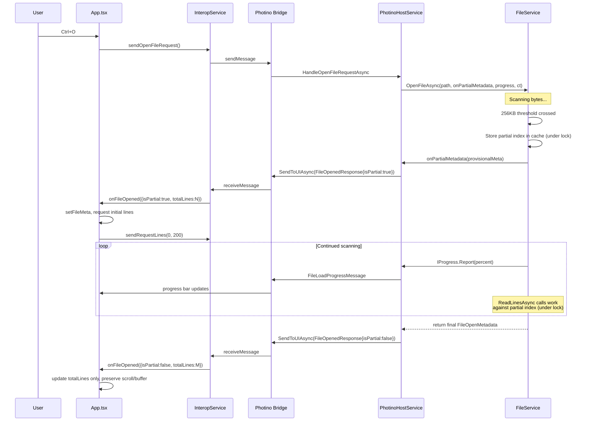
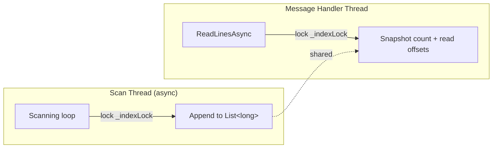

# Design Document: Early Content Display for Large Files

## Overview

Show file content immediately after first 256KB scanned for large files. Scan continues in background → progress bar updates → scrollbar range updates to final value on completion. Small files unaffected.

**Core change:** `FileService.OpenFileAsync` gains `Action<FileOpenMetadata>? onPartialMetadata` callback. After scanning 256KB of a large file, callback fires with provisional metadata. `PhotinoHostService` sends partial `FileOpenedResponse` (`isPartial: true`) → UI renders content immediately. Scan continues → final `FileOpenedResponse` (`isPartial: false`) updates scrollbar range.

**Key design decisions:**
- Callback-based notification (`Action<FileOpenMetadata>?`) over event/observable — single-fire, simple, matches existing `IProgress<T>` pattern
- `lock` around `List<long>` for thread safety — simpler than `ConcurrentBag` since we need indexed access and append-only semantics
- `isPartial` boolean added to `FileOpenedResponse` — reuses existing message type, frontend handles both partial and final via same `onFileOpened` callback
- StatusBar shows progress bar **alongside** metadata during partial display (not replacing metadata)
- `ReadLinesAsync` clamps to available indexed lines — no error for out-of-range during partial scan

## Architecture

### Partial Metadata Flow (Large File)



### Thread Safety Model



### Cancellation Flow

Unchanged from existing design. `CancellationTokenSource` in `PhotinoHostService` cancels in-progress scan when new file opened. Partial state cleared in App.tsx `onFileOpened` handler (new file replaces old).

## Components and Interfaces

### Backend (C#)

#### IFileService — Modified Signature

```csharp
Task<FileOpenMetadata> OpenFileAsync(
    string filePath,
    Action<FileOpenMetadata>? onPartialMetadata = null,
    IProgress<FileLoadProgress>? progress = null,
    CancellationToken cancellationToken = default);
```

New `onPartialMetadata` param inserted before `progress`. Invoked at most once per call when 256KB threshold crossed on large files. Never invoked for small files.

#### FileService — Internal Changes

1. **New field:** `private readonly object _indexLock = new();`
2. **`_lineIndexCache` stays `Dictionary<string, List<long>>`** — lock protects concurrent access
3. **Scanning loop changes:**
   - After each buffer read, check if `totalBytesRead >= SizeThresholdBytes` and `!partialEmitted`
   - If threshold crossed: acquire lock → store partial index in cache → release lock → invoke `onPartialMetadata` callback with provisional metadata → set `partialEmitted = true`
   - All subsequent `lineOffsets.Add()` calls wrapped in lock
   - Final cache store also under lock
4. **`ReadLinesAsync` changes:**
   - Acquire lock → snapshot `lineOffsets.Count` and copy needed offsets → release lock
   - Use snapshot for file reads (no lock held during I/O)
   - Clamp requested range to snapshot count

#### FileOpenedResponse — New Field

```csharp
[JsonPropertyName("isPartial")]
public bool IsPartial { get; set; }
```

#### PhotinoHostService — Modified `OpenFileByPathAsync`

```csharp
// Partial metadata callback — sends partial FileOpenedResponse
Action<FileOpenMetadata> onPartialMetadata = (partialMeta) =>
{
    _currentFilePath = filePath;
    _ = _messageRouter.SendToUIAsync(new FileOpenedResponse
    {
        FileName = partialMeta.FileName,
        TotalLines = partialMeta.TotalLines,
        FileSizeBytes = partialMeta.FileSizeBytes,
        Encoding = partialMeta.Encoding,
        IsPartial = true
    });
};

var metadata = await _fileService.OpenFileAsync(filePath, onPartialMetadata, progress, _scanCts.Token);

// Send final metadata
_currentFilePath = filePath;
await _messageRouter.SendToUIAsync(new FileOpenedResponse
{
    FileName = metadata.FileName,
    TotalLines = metadata.TotalLines,
    FileSizeBytes = metadata.FileSizeBytes,
    Encoding = metadata.Encoding,
    IsPartial = false
});
```

### Frontend (TypeScript/React)

#### InteropService — FileMeta Extended

```typescript
interface FileMeta {
  fileName: string;
  totalLines: number;
  fileSizeBytes: number;
  encoding: string;
  isPartial: boolean;  // NEW
}
```

No other InteropService changes needed — existing `onFileOpened` callback receives `FileMeta` with new field. Backend sends same `FileOpenedResponse` message type.

#### App.tsx — Dual FileOpenedResponse Handling

```typescript
interop.onFileOpened((data: FileMeta) => {
  if (data.isPartial) {
    // Partial metadata — show content immediately
    setFileMeta(data);
    setIsLoading(false);
    setError(null);
    setTitleBarText(`${data.fileName} - Editor`);
    // DON'T clear loadProgress — progress bar stays visible
    // Request initial lines
    lastRequestedStartRef.current = 0;
    interop.sendRequestLines(0, 200);
  } else {
    // Final metadata
    if (fileMeta && fileMeta.fileName === data.fileName) {
      // Same file — update totalLines only, preserve scroll/buffer
      setFileMeta(data);
      setLoadProgress(null);
    } else {
      // Different file (small file or first open) — full reset
      setFileMeta(data);
      setIsLoading(false);
      setError(null);
      setLoadProgress(null);
      setTitleBarText(`${data.fileName} - Editor`);
      lastRequestedStartRef.current = 0;
      interop.sendRequestLines(0, 200);
    }
  }
});
```

Key behavior: on partial → request lines + keep progress bar. On final for same file → update `totalLines` only (scrollbar range updates, content preserved).

#### StatusBar — Progress Alongside Metadata

Current StatusBar shows progress bar OR metadata (mutually exclusive). Change to show both during partial display:

```typescript
function StatusBar({ metadata, wrapLines, onWrapLinesChange, loadProgress }: StatusBarProps) {
  const showProgress = loadProgress != null && loadProgress.percent < 100;

  return (
    <div className="status-bar" role="contentinfo">
      {metadata ? (
        <div className="status-bar__items">
          <span className="status-bar__item">{formatFileSize(metadata.fileSizeBytes)}</span>
          <span className="status-bar__separator" aria-hidden="true">|</span>
          <span className="status-bar__item">{metadata.totalLines} lines</span>
          <span className="status-bar__separator" aria-hidden="true">|</span>
          <span className="status-bar__item">{metadata.encoding}</span>
        </div>
      ) : null}
      {showProgress ? (
        <div className="progress-bar" role="progressbar"
             aria-valuenow={loadProgress.percent} aria-valuemin={0} aria-valuemax={100}>
          <div className="progress-bar__fill" style={{ width: `${loadProgress.percent}%` }} />
          <span className="progress-bar__text">Loading: {loadProgress.percent}%</span>
        </div>
      ) : null}
      {!showProgress ? (
        <label className="status-bar__wrap-toggle">
          <input type="checkbox" className="status-bar__wrap-checkbox"
                 checked={wrapLines} onChange={(e) => onWrapLinesChange(e.target.checked)} />
          Wrap Lines
        </label>
      ) : null}
    </div>
  );
}
```

Progress bar and metadata items render side-by-side. Wrap toggle hidden during scan (replaced by progress bar area).

#### ContentArea — No Structural Changes

ContentArea already works with `fileMeta.totalLines` as scrollbar range. When `fileMeta` updates (final metadata), React re-renders → `CustomScrollbar` gets new `range` prop → scrollbar range expands. Current scroll position and buffer preserved because `lines` and `linesStartLine` state unchanged.

`ReadLinesAsync` clamping on backend ensures no out-of-range errors during partial display.

## Data Models

### New Fields

| Type | Field | Type | Description |
|------|-------|------|-------------|
| `FileOpenedResponse` | `IsPartial` | `bool` | `true` = provisional metadata, `false` = final |
| `FileMeta` (TS) | `isPartial` | `boolean` | Mirror of backend field |

### Modified Signatures

| Method | Change |
|--------|--------|
| `IFileService.OpenFileAsync` | Add `Action<FileOpenMetadata>? onPartialMetadata` param (2nd position) |
| `FileService.OpenFileAsync` | Implement partial callback + lock-based thread safety |
| `FileService.ReadLinesAsync` | Lock-based snapshot reads + range clamping |
| `PhotinoHostService.OpenFileByPathAsync` | Wire `onPartialMetadata` callback, send partial + final responses |

### New Internal State

| Component | Field | Type | Purpose |
|-----------|-------|------|---------|
| `FileService` | `_indexLock` | `object` | Lock for `_lineIndexCache` concurrent access |

### Constants (Unchanged)

| Constant | Value | Location |
|----------|-------|----------|
| `SizeThresholdBytes` | `256_000` | `FileService.cs` |
| `ProgressThrottleMs` | `50` | `FileService.cs` |
| `WINDOW_SIZE` | `400` | `ContentArea.tsx` |
| `FETCH_SIZE` | `200` | `ContentArea.tsx` |


## Correctness Properties

*A property is a characteristic or behavior that should hold true across all valid executions of a system — essentially, a formal statement about what the system should do. Properties serve as the bridge between human-readable specifications and machine-verifiable correctness guarantees.*

### Property 1: Partial index read clamping and totalLines accuracy

*For any* partially built line offset index with N indexed lines, and *for any* `ReadLinesAsync` request with arbitrary `startLine` and `lineCount`, the result SHALL satisfy: (a) returned lines are a subset of the indexed range `[0, N)`, (b) `LinesResult.TotalLines` equals N, and (c) if the request extends beyond N, the returned line count equals `min(lineCount, N - startLine)` with no error thrown.

**Validates: Requirements 1.1, 3.1, 3.2, 3.3**

### Property 2: Partial metadata callback fires exactly once for large files

*For any* file with size > 256,000 bytes, calling `OpenFileAsync` with an `onPartialMetadata` callback SHALL invoke that callback exactly once. *For any* file with size ≤ 256,000 bytes, the callback SHALL never be invoked.

**Validates: Requirements 1.3, 10.2**

### Property 3: Index available when partial callback fires

*For any* large file, when the `onPartialMetadata` callback is invoked, `ReadLinesAsync` called from within that callback for line 0 SHALL succeed and return at least one line, proving the partial index is already stored and readable.

**Validates: Requirements 10.3**

### Property 4: Provisional totalLines matches indexed line count at threshold

*For any* large file with varying line lengths, the `totalLines` value in the `FileOpenMetadata` passed to the `onPartialMetadata` callback SHALL equal the number of complete lines found in the first 256,000+ bytes of the file (the actual count of entries in the partial line offset index at callback time).

**Validates: Requirements 4.2**

### Property 5: Thread-safe concurrent index access

*For any* interleaving of concurrent append operations (simulating the scanning thread) and `ReadLinesAsync` calls (simulating the message handler thread) on the same file's line offset index, all `ReadLinesAsync` calls SHALL return consistent results without throwing exceptions, and the returned `TotalLines` SHALL be ≤ the final index size.

**Validates: Requirements 8.1**

### Property 6: StatusBar renders progress bar alongside metadata during partial display

*For any* valid `FileMeta` object and *for any* `loadProgress` with `percent` in `[0, 99]`, the StatusBar SHALL render both the file metadata items (file size, line count, encoding) and the progress bar simultaneously in the DOM.

**Validates: Requirements 7.1**

## Error Handling

| Scenario | Backend Behavior | Frontend Behavior |
|----------|-----------------|-------------------|
| IOException during scan (before partial) | Stop scan, send `ErrorResponse` | Show error in ContentArea, no partial content |
| IOException during scan (after partial) | Stop scan, send `ErrorResponse` | Hide progress bar, show error, partial content may remain visible until error clears it |
| OperationCanceledException (new file opened) | Swallow exception, log info, no `ErrorResponse` sent | New file's `onFileOpened` replaces partial state |
| ReadLinesAsync called before any index exists | Throw `InvalidOperationException` | Existing error handling in `HandleRequestLinesAsync` sends `ErrorResponse` |
| ReadLinesAsync request beyond partial index | Clamp to available lines, return partial result | ContentArea renders available lines normally |
| FileNotFoundException | Stop scan, send `ErrorResponse` with `FILE_NOT_FOUND` | Hide progress bar, show error |
| UnauthorizedAccessException | Stop scan, send `ErrorResponse` with `PERMISSION_DENIED` | Hide progress bar, show error |

**Key change from existing error handling:** Errors during scan after partial metadata was sent leave the UI in a state where partial content is visible. The `ErrorResponse` handler in App.tsx should clear `fileMeta` and `lines` state to remove stale partial content. This is handled by existing `onError` callback which sets `error` state → ContentArea renders error view instead of content.

## Testing Strategy

### Property-Based Tests (C# — FsCheck)

PBT is appropriate for this feature because core logic involves:
- Pure index operations (clamping, counting, snapshotting)
- Invariants across input ranges (callback cardinality, index availability)
- Concurrency properties (thread-safe reads during writes)
- Input-varying behavior (different file contents → different line counts at threshold)

**Configuration:** Minimum 100 iterations per property test.
**Tag format:** `Feature: early-content-display, Property {N}: {title}`

| Property | Test Approach |
|----------|--------------|
| P1: Partial index read clamping | Generate random `List<long>` (partial index), random `startLine`/`lineCount`. Call `ReadLinesAsync` against mock file with that index. Verify clamping and totalLines. |
| P2: Callback fires exactly once | Generate random file content > 256KB with varying line lengths. Call `OpenFileAsync`. Count callback invocations. Also test files ≤ 256KB → zero invocations. |
| P3: Index available at callback | Generate random large file content. In callback, call `ReadLinesAsync(path, 0, 1)`. Verify success. |
| P4: Provisional totalLines accuracy | Generate random file content with known line positions. Compute expected line count at 256KB. Verify callback's `totalLines` matches. |
| P5: Thread-safe concurrent access | Generate random index size. Spawn concurrent append + read tasks. Verify no exceptions and consistent results. |
| P6: StatusBar progress alongside metadata | Generate random `FileMeta` + random `loadProgress` (percent 0-99). Render StatusBar. Verify both metadata items and progress bar present. |

### Unit Tests (Example-Based)

| Test | What it verifies |
|------|-----------------|
| Small file (100 bytes) → no partial callback, single final response | Req 1.3 |
| File exactly at threshold (256,000 bytes) → no partial callback | Boundary of Req 1.3 |
| File at threshold+1 (256,001 bytes) → partial callback fires | Boundary of Req 10.2 |
| `FileOpenedResponse` JSON contains `isPartial` field | Req 4.1 |
| App.tsx: partial `onFileOpened` → sets fileMeta + requests lines | Req 5.1 |
| App.tsx: final `onFileOpened` for same file → updates totalLines only | Req 6.1, 6.3 |
| App.tsx: final `onFileOpened` → clears loadProgress | Req 7.2 |
| ContentArea: fileMeta.totalLines update → CustomScrollbar range updates | Req 6.2 |
| ContentArea: fileMeta update preserves scroll position and buffer | Req 6.3 |
| StatusBar: loadProgress=null → no progress bar, metadata visible | Req 7.2 |
| Cancellation during scan → no final response sent | Req 9.1 |
| New file open after partial → replaces partial content | Req 9.2, 9.3 |
| PhotinoHostService sends partial then final FileOpenedResponse | Req 1.2, 2.3 |
| Progress messages continue after partial metadata | Req 2.2 |

### Integration Tests

| Test | What it verifies |
|------|-----------------|
| End-to-end: open large file → partial response → lines displayed → final response → scrollbar updated | Full pipeline |
| End-to-end: open large file, open another mid-scan → cancellation → new file loads correctly | Cancellation pipeline |
| End-to-end: open large file → ReadLinesAsync during scan → correct clamped results | Concurrent access pipeline |
