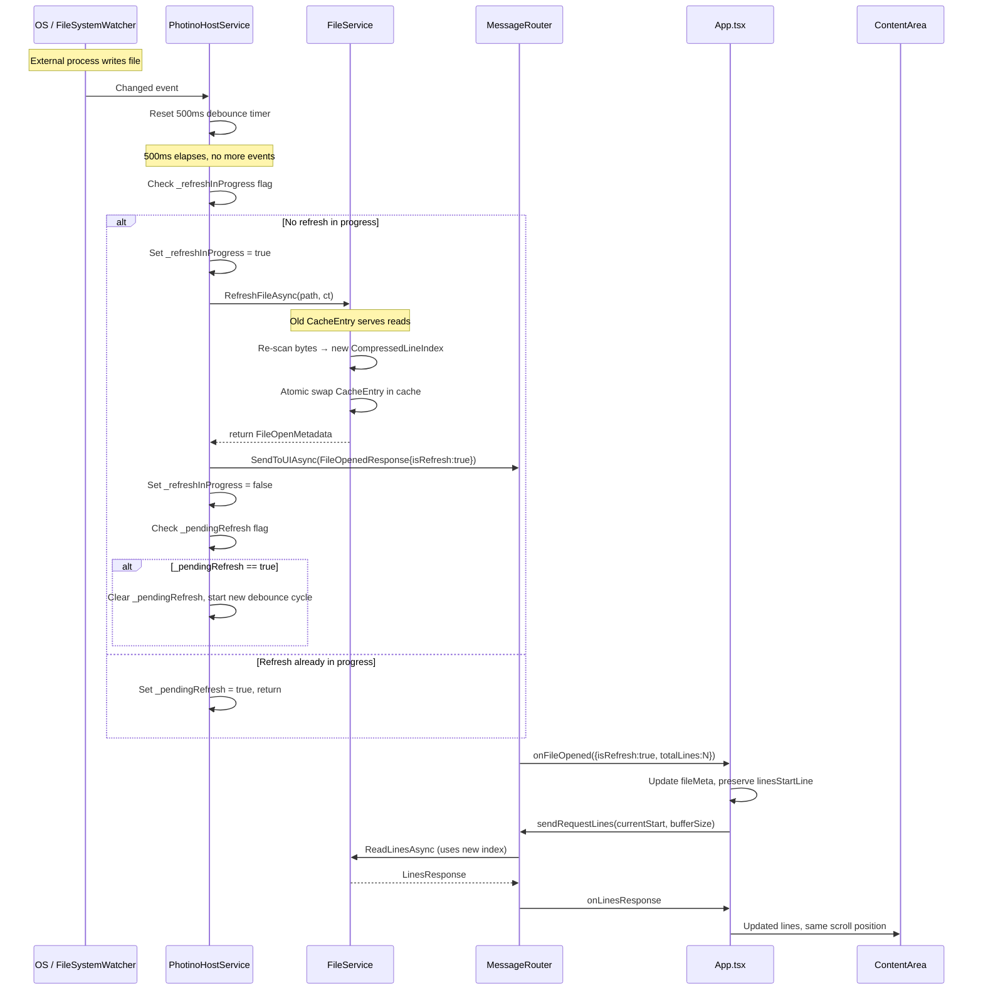
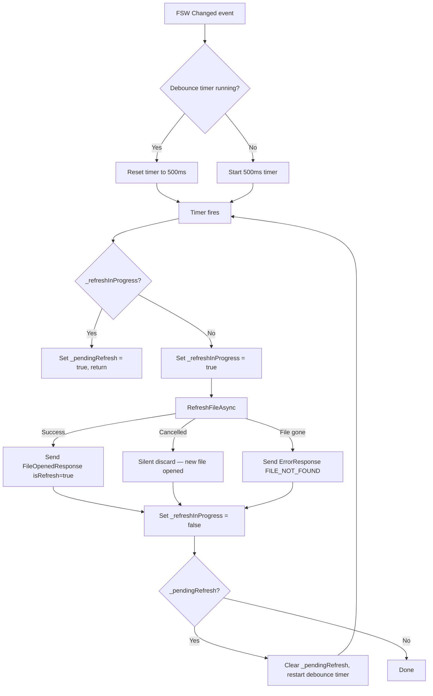
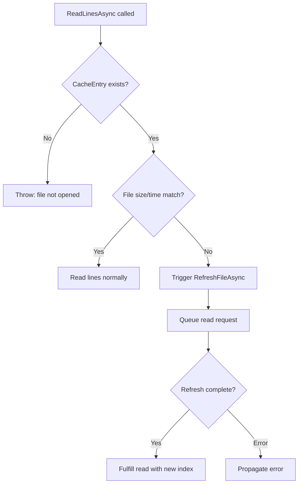

# Design Document: External File Refresh

## Overview

Detect external file modifications and transparently refresh editor state — line index, cache, displayed content — without scroll jumps or errors. Replace current `InvalidOperationException` on stale file with automatic silent re-indexing.

**Core changes:**
- **FileWatcher** (new): `FileSystemWatcher` wrapper in `PhotinoHostService` monitors current file. On change → debounced 500ms → triggers refresh cycle.
- **FileService.RefreshFileAsync** (new): Rebuilds `CompressedLineIndex` in background while old `CacheEntry` serves reads. Atomic swap on completion.
- **FileService.ReadLinesAsync** (modified): Stale detection triggers refresh instead of throwing. Queued reads fulfilled after re-index.
- **FileOpenedResponse.IsRefresh** (new field): Frontend distinguishes refresh from new-file-open → preserves scroll + re-requests buffer.
- **App.tsx refresh handler**: On `isRefresh` → keep `linesStartLine`/`scrollTop`, re-request current buffer range, clamp if file shrunk.

**Key design decisions:**
- `FileSystemWatcher` over polling — lower latency, OS-native, with `EnableRaisingEvents` toggle. Polling fallback via `Timer` if watcher errors fire.
- Debounce in `PhotinoHostService` via `System.Threading.Timer` — simpler than Rx, matches existing `_scanCts` pattern.
- Old cache serves reads during re-index — no interruption. New `CacheEntry` swapped atomically via `ConcurrentDictionary` update. Old `CompressedLineIndex` disposed on swap to prevent memory leaks.
- **Non-interruptible refresh model** — same-file change notifications do NOT cancel an in-progress refresh. Instead, a `_pendingRefresh` flag is set. After the current refresh completes and the debounce window elapses, a new cycle starts. This prevents starvation for rapidly-updating files (e.g. real-time logs). Only opening a *different* file cancels via `_refreshCts`.
- **Separate CancellationTokenSources** — `_scanCts` for file-open, `_refreshCts` for refresh (linked to `_shutdownCts`). Prevents interference between file-open and refresh operations. `_shutdownCts` ensures clean process exit.
- **FileShare.ReadWrite** — all file reads use `FileShare.ReadWrite` so reading doesn't block/fail while another process writes.
- `isRefresh` flag on `FileOpenedResponse` — minimal protocol change, frontend already handles same-file final metadata.

## Architecture

### File Change Detection & Refresh Flow



### Debounce & Cancellation Model



### Stale Detection Replacement



## Components and Interfaces

### Backend (C#)

#### IFileService — New Method

```csharp
/// <summary>
/// Re-scan a previously opened file to rebuild its line index after external modification.
/// Old CacheEntry remains valid for reads until new index is ready.
/// </summary>
Task<FileOpenMetadata> RefreshFileAsync(
    string filePath,
    IProgress<FileLoadProgress>? progress = null,
    CancellationToken cancellationToken = default);
```

#### IFileService — Modified ReadLinesAsync

Signature unchanged. Behavior change: stale detection triggers refresh instead of throwing `InvalidOperationException`.

```csharp
/// <summary>
/// Read lines. If file is stale, triggers refresh and queues the read
/// instead of throwing InvalidOperationException.
/// </summary>
Task<LinesResult> ReadLinesAsync(
    string filePath, int startLine, int lineCount,
    CancellationToken cancellationToken = default);
```

#### FileService — RefreshFileAsync Implementation

```csharp
public async Task<FileOpenMetadata> RefreshFileAsync(
    string filePath,
    IProgress<FileLoadProgress>? progress = null,
    CancellationToken cancellationToken = default)
{
    // Quick check: skip re-scan if file hasn't actually changed since last cache entry.
    if (_lineIndexCache.TryGetValue(filePath, out var existing))
    {
        var fi = new FileInfo(filePath);
        if (fi.Exists && fi.Length == existing.FileSize && fi.LastWriteTimeUtc == existing.LastWriteTimeUtc)
        {
            var encodingName = GetEncodingDisplayName(existing.Encoding);
            return new FileOpenMetadata(filePath, fi.Name, existing.Index.LineCount, existing.FileSize, encodingName);
        }
    }

    // OpenFileAsync handles old index disposal via cache swap
    return await OpenFileAsync(filePath, onPartialMetadata: null, progress, cancellationToken);
}
```

`OpenFileAsync` already handles the full scan + cache update + old index disposal. When the cache entry is replaced, the old `CompressedLineIndex` is disposed to free memory. Because `_lineIndexCache` is a `ConcurrentDictionary`, the old entry serves reads until the final swap. The early-exit check prevents redundant scans when the file hasn't actually changed.

#### FileService — ReadLinesAsync Stale Detection Change

Remove `InvalidOperationException` throw. Instead, expose a stale-detection event/callback so `PhotinoHostService` can trigger a refresh cycle:

```csharp
/// <summary>
/// Event raised when ReadLinesAsync detects a stale file.
/// PhotinoHostService subscribes to trigger refresh cycle.
/// </summary>
public event Action<string>? OnStaleFileDetected;
```

When stale detected in `ReadLinesAsync`:
1. Fire `OnStaleFileDetected(filePath)` 
2. Serve the read using the **existing** (stale) cache entry — user sees old content briefly
3. `PhotinoHostService` handles the event → triggers debounced refresh cycle → frontend gets updated content

This avoids blocking the read request and keeps the UX smooth. The alternative (queue + wait) adds complexity and latency for the user.

#### PhotinoHostService — File Watcher Integration

New fields:

```csharp
private FileSystemWatcher? _fileWatcher;
private System.Threading.Timer? _debounceTimer;
private const int DebounceMs = 500;

/// <summary>
/// Cancellation token source for the current refresh operation.
/// Separate from _scanCts so file-open and refresh don't interfere.
/// Cancelled on shutdown or when opening a different file.
/// </summary>
private CancellationTokenSource? _refreshCts;

/// <summary>
/// Master shutdown token — cancelled in Shutdown() to stop all background work.
/// </summary>
private readonly CancellationTokenSource _shutdownCts = new();

/// <summary>
/// Guard flag — true while a refresh cycle is executing.
/// Prevents same-file change notifications from cancelling in-progress refresh.
/// Uses Interlocked for thread-safe access.
/// </summary>
private int _refreshInProgress;

/// <summary>
/// Set to true when a change notification arrives while _refreshInProgress is true.
/// After the current refresh completes, a new debounce cycle starts.
/// </summary>
private volatile bool _pendingRefresh;
```

New methods:

```csharp
/// <summary>
/// Start watching the given file path. Disposes previous watcher if any.
/// </summary>
private void StartWatching(string filePath)
{
    StopWatching();
    var dir = Path.GetDirectoryName(filePath)!;
    var name = Path.GetFileName(filePath);
    _fileWatcher = new FileSystemWatcher(dir, name)
    {
        NotifyFilter = NotifyFilters.LastWrite | NotifyFilters.Size,
        EnableRaisingEvents = true
    };
    _fileWatcher.Changed += OnFileChanged;
    _fileWatcher.Error += OnWatcherError;
}

/// <summary>
/// Stop watching and dispose watcher resources.
/// </summary>
private void StopWatching()
{
    if (_fileWatcher is not null)
    {
        _fileWatcher.EnableRaisingEvents = false;
        _fileWatcher.Changed -= OnFileChanged;
        _fileWatcher.Error -= OnWatcherError;
        _fileWatcher.Dispose();
        _fileWatcher = null;
    }
    _debounceTimer?.Dispose();
    _debounceTimer = null;
}

/// <summary>
/// FSW changed handler — reset debounce timer.
/// </summary>
private void OnFileChanged(object sender, FileSystemEventArgs e)
{
    if (_shutdownCts.IsCancellationRequested) return;
    _debounceTimer?.Dispose();
    _debounceTimer = new System.Threading.Timer(
        _ => _ = OnDebouncedFileChange(),
        null,
        DebounceMs,
        Timeout.Infinite);
}

/// <summary>
/// Debounce elapsed — trigger refresh cycle.
/// Uses Interlocked guard to prevent overlapping refreshes.
/// Same-file change notifications do NOT cancel in-progress refresh;
/// instead _pendingRefresh is set and a new cycle starts after completion.
/// Only opening a different file (OpenFileByPathAsync) cancels via _refreshCts.
/// </summary>
private async Task OnDebouncedFileChange()
{
    if (_shutdownCts.IsCancellationRequested) return;
    if (string.IsNullOrEmpty(_currentFilePath)) return;

    // If refresh already running, mark pending and return.
    if (Interlocked.CompareExchange(ref _refreshInProgress, 1, 0) != 0)
    {
        _pendingRefresh = true;
        return;
    }

    try
    {
        // Create a dedicated CTS for this refresh, linked to shutdown.
        _refreshCts?.Dispose();
        _refreshCts = CancellationTokenSource.CreateLinkedTokenSource(_shutdownCts.Token);

        var metadata = await _fileService.RefreshFileAsync(
            _currentFilePath, progress: null, _refreshCts.Token);

        if (!_shutdownCts.IsCancellationRequested)
        {
            await _messageRouter.SendToUIAsync(new FileOpenedResponse
            {
                FileName = metadata.FileName,
                TotalLines = metadata.TotalLines,
                FileSizeBytes = metadata.FileSizeBytes,
                Encoding = metadata.Encoding,
                IsPartial = false,
                IsRefresh = true
            });
        }
    }
    catch (OperationCanceledException)
    {
        // Cancelled — shutdown or new file opened. Silent.
    }
    catch (FileNotFoundException)
    {
        if (!_shutdownCts.IsCancellationRequested)
        {
            await _messageRouter.SendToUIAsync(new ErrorResponse
            {
                ErrorCode = Models.ErrorCode.FILE_NOT_FOUND.ToString(),
                Message = "The file has been deleted or moved.",
                Details = _currentFilePath
            });
        }
    }
    catch (Exception ex)
    {
        Console.Error.WriteLine($"[ERROR] Refresh failed: {ex}");
    }
    finally
    {
        Interlocked.Exchange(ref _refreshInProgress, 0);

        // If a change arrived while we were refreshing, start a new debounce cycle.
        if (_pendingRefresh && !_shutdownCts.IsCancellationRequested)
        {
            _pendingRefresh = false;
            _debounceTimer?.Dispose();
            _debounceTimer = new System.Threading.Timer(
                _ => _ = OnDebouncedFileChange(),
                null,
                DebounceMs,
                Timeout.Infinite);
        }
    }
}

/// <summary>
/// Watcher error — could indicate network drive disconnect, etc.
/// Fall back to polling or log warning.
/// </summary>
private void OnWatcherError(object sender, ErrorEventArgs e)
{
    Console.Error.WriteLine($"[WARN] FileSystemWatcher error: {e.GetException()}");
    // Watcher may auto-recover. If not, stale detection in ReadLinesAsync
    // serves as fallback — it will trigger refresh on next read.
}
```

Wire into `OpenFileByPathAsync`:

```csharp
// Cancel any existing scan or refresh in progress
_scanCts?.Cancel();
_scanCts?.Dispose();
_refreshCts?.Cancel();
_refreshCts?.Dispose();
_refreshCts = null;
_pendingRefresh = false;

// After successful file open, start watching
StartWatching(filePath);
```

Wire into `Shutdown`:

```csharp
public void Shutdown()
{
    _shutdownCts.Cancel();
    _refreshCts?.Cancel();
    _scanCts?.Cancel();
    StopWatching();
    _shutdownCts.Dispose();
    _refreshCts?.Dispose();
    _scanCts?.Dispose();
}
```

Subscribe to stale detection:

```csharp
// In constructor or RegisterMessageHandlers
if (_fileService is FileService fs)
{
    fs.OnStaleFileDetected += (path) =>
    {
        if (path == _currentFilePath)
        {
            OnFileChanged(this, new FileSystemEventArgs(WatcherChangeTypes.Changed, 
                Path.GetDirectoryName(path)!, Path.GetFileName(path)));
        }
    };
}
```

### Frontend (TypeScript/React)

#### FileOpenedResponse — New Field

```typescript
interface FileMeta {
  fileName: string;
  totalLines: number;
  fileSizeBytes: number;
  encoding: string;
  isPartial: boolean;
  isRefresh: boolean;  // NEW
}
```

#### App.tsx — Refresh Handler

Add refresh handling to `onFileOpened` callback:

```typescript
interop.onFileOpened((data: FileMeta) => {
  if (data.isRefresh) {
    // Refresh — preserve scroll position, re-request buffer
    const prevMeta = fileMetaRef.current;
    const currentStart = linesStartRef.current;
    const currentCount = linesRef.current ? linesRef.current.length : 0;

    // Update metadata (totalLines may have changed)
    setFileMeta(data);
    setError(null);

    if (data.totalLines === 0) {
      // File emptied
      setLines(null);
      setLinesStartLine(0);
      return;
    }

    // Clamp if file shrunk
    let newStart = currentStart;
    const bufferLen = Math.max(currentCount, APP_FETCH_SIZE);
    if (newStart >= data.totalLines) {
      newStart = Math.max(0, data.totalLines - bufferLen);
      setLinesStartLine(newStart);
    }

    // Re-request current buffer range
    const count = Math.min(bufferLen, data.totalLines - newStart);
    lastRequestedStartRef.current = newStart;
    isJumpRequestRef.current = true; // Replace buffer entirely
    interop.sendRequestLines(newStart, count);
    return;
  }

  if (data.isPartial) {
    // ... existing partial handling
  } else {
    // ... existing final handling
  }
});
```

Key behaviors:
- `isRefresh` → preserve `linesStartLine`, re-request same range
- `isJumpRequestRef = true` → `onLinesResponse` replaces buffer entirely (no merge)
- If file shrunk past current position → clamp to end
- `setError(null)` → clears any previous stale error

#### ContentArea — No Structural Changes

Buffer replacement via jump mechanism already handles in-place content update. `scrollTop` preserved because:
1. Jump replaces buffer at same `linesStartLine` (or clamped)
2. `useLayoutEffect` jump path scrolls to target line within buffer
3. If `linesStartLine` unchanged and line heights similar → no visible jump

If line heights change within visible range, the existing `useLayoutEffect` handles scroll adjustment.

## Data Models

### New Fields

| Type | Field | Type | Description |
|------|-------|------|-------------|
| `FileOpenedResponse` (C#) | `IsRefresh` | `bool` | `true` = refresh after external modification |
| `FileMeta` (TS) | `isRefresh` | `boolean` | Mirror of backend field |

### New Types

| Type | Location | Description |
|------|----------|-------------|
| `FileService.OnStaleFileDetected` | `FileService.cs` | Event fired when `ReadLinesAsync` detects stale cache |

### New Methods

| Method | Location | Description |
|--------|----------|-------------|
| `IFileService.RefreshFileAsync` | `IFileService.cs` | Re-scan file, rebuild index, atomic cache swap |
| `PhotinoHostService.StartWatching` | `PhotinoHostService.cs` | Create `FileSystemWatcher` for current file |
| `PhotinoHostService.StopWatching` | `PhotinoHostService.cs` | Dispose watcher + debounce timer |
| `PhotinoHostService.OnFileChanged` | `PhotinoHostService.cs` | FSW handler → reset debounce |
| `PhotinoHostService.OnDebouncedFileChange` | `PhotinoHostService.cs` | Trigger refresh cycle |

### Modified Methods

| Method | Change |
|--------|--------|
| `FileService.ReadLinesAsync` | Remove `InvalidOperationException` throw, fire `OnStaleFileDetected` event (throttled), serve read from existing cache. Use `FileShare.ReadWrite`. |
| `FileService.OpenFileAsync` | Use `FileShare.ReadWrite` for file streams. Dispose old `CompressedLineIndex` when replacing cache entry. |
| `PhotinoHostService.OpenFileByPathAsync` | Cancel both `_scanCts` and `_refreshCts`, clear `_pendingRefresh`. Call `StartWatching` after successful open. |
| `PhotinoHostService.Shutdown` | Cancel `_shutdownCts` + `_refreshCts` + `_scanCts`, call `StopWatching`, dispose all CTS. |

### Constants

| Constant | Value | Location |
|----------|-------|----------|
| `DebounceMs` | `500` | `PhotinoHostService.cs` |

### New Internal State

| Field | Type | Location | Description |
|-------|------|----------|-------------|
| `_refreshInProgress` | `int` (Interlocked) | `PhotinoHostService.cs` | Guard flag — 1 while refresh executing, 0 otherwise. Prevents same-file change from cancelling in-progress refresh. |
| `_pendingRefresh` | `volatile bool` | `PhotinoHostService.cs` | Set when change notification arrives during in-progress refresh. Triggers new debounce cycle after current refresh completes. |
| `_refreshCts` | `CancellationTokenSource?` | `PhotinoHostService.cs` | Dedicated CTS for refresh operations, linked to `_shutdownCts`. Separate from `_scanCts` to prevent interference. |
| `_shutdownCts` | `CancellationTokenSource` | `PhotinoHostService.cs` | Master shutdown token. Cancelled in `Shutdown()` to stop all background work and ensure clean process exit. |


## Correctness Properties

*A property is a characteristic or behavior that should hold true across all valid executions of a system — essentially, a formal statement about what the system should do. Properties serve as the bridge between human-readable specifications and machine-verifiable correctness guarantees.*

### Property 1: Debounce coalesces rapid events into single refresh

*For any* sequence of N change notifications (N ≥ 1) arriving within a 500ms window, the debounce logic SHALL produce exactly one refresh trigger, fired after 500ms from the last notification.

**Validates: Requirements 2.1**

### Property 2: Non-interruptible refresh with pending flag

*For any* refresh cycle in progress for the current file, if a new same-file change notification arrives, the in-progress refresh SHALL NOT be cancelled. The `_pendingRefresh` flag SHALL be set, the current refresh SHALL complete normally, and a new refresh cycle SHALL start after the current one completes and the debounce window (500ms) elapses.

**Validates: Requirements 2.2, 8.2**

### Property 3: Refresh produces correct index matching modified file

*For any* file with initial content C1 and modified content C2, after `RefreshFileAsync` completes, the cached `CompressedLineIndex` SHALL have `LineCount` equal to the number of lines in C2, and `ReadLinesAsync(path, 0, lineCount)` SHALL return the lines of C2.

**Validates: Requirements 3.1, 3.2**

### Property 4: Old cache serves reads during refresh

*For any* file with cached content C1 undergoing refresh to C2, all `ReadLinesAsync` calls that begin before the refresh completes SHALL return data from C1 without throwing exceptions.

**Validates: Requirements 3.3**

### Property 5: Frontend preserves scroll position and re-requests buffer on refresh

*For any* App state with `linesStartLine = S` and buffer length `L`, when a refresh `FileOpenedResponse` arrives with `totalLines >= S + L`, the handler SHALL preserve `linesStartLine = S` and call `sendRequestLines(S, max(L, APP_FETCH_SIZE))`.

**Validates: Requirements 5.1, 5.2**

### Property 6: Clamp on file shrink

*For any* App state with `linesStartLine = S` and buffer length `L`, when a refresh `FileOpenedResponse` arrives with `newTotalLines < S`, the handler SHALL set `linesStartLine` to `max(0, newTotalLines - L)` and request lines from that clamped position.

**Validates: Requirements 5.4**

### Property 7: Stale detection triggers event instead of exception

*For any* file where `FileSize` or `LastWriteTimeUtc` differs from the cached `CacheEntry`, calling `ReadLinesAsync` SHALL NOT throw `InvalidOperationException`. Instead, it SHALL fire `OnStaleFileDetected` and return lines from the existing cache.

**Validates: Requirements 7.1, 7.3**

## Error Handling

| Scenario | Backend Behavior | Frontend Behavior |
|----------|-----------------|-------------------|
| File deleted during refresh | `RefreshFileAsync` throws `FileNotFoundException` → `OnDebouncedFileChange` catches → sends `ErrorResponse` with `FILE_NOT_FOUND` | ContentArea shows error, clears content |
| File permissions revoked during refresh | `RefreshFileAsync` throws `UnauthorizedAccessException` → sends `ErrorResponse` with `PERMISSION_DENIED` | ContentArea shows error |
| Refresh cancelled (new file opened) | `OperationCanceledException` caught silently, no message sent (Req 8.3) | No effect — new file's `onFileOpened` replaces state |
| Same-file change during refresh | `_pendingRefresh` flag set, current refresh completes normally. New debounce cycle starts after completion. | No effect — next refresh will send updated response |
| FileSystemWatcher error (network drive, etc.) | Log warning. Stale detection in `ReadLinesAsync` serves as fallback | No immediate effect — refresh triggers on next read |
| File emptied (0 bytes) | `RefreshFileAsync` returns `totalLines=0` | App clears buffer, shows empty content area |
| ReadLinesAsync on stale file | Fire `OnStaleFileDetected`, serve from old cache | User sees old content briefly, then refresh updates it |
| IOException during refresh scan | Catch in `OnDebouncedFileChange`, log error, no crash | No message sent — next change event retries |

**Key change from existing error handling:** `InvalidOperationException("File has been modified since it was opened")` is removed entirely. Stale files trigger a refresh cycle instead. Users never see "file modified" errors.

## Testing Strategy

### Property-Based Tests

PBT is appropriate for this feature because core logic involves:
- Debounce timing logic (pure function of event timestamps → trigger count)
- Index correctness after refresh (pure scan logic, input-varying file content)
- Concurrent cache access (invariant: old cache always readable during refresh)
- Frontend state clamping (pure arithmetic on line positions)
- Stale detection behavior (input-varying file states)

**Configuration:** Minimum 100 iterations per property test.
**Tag format:** `Feature: external-file-refresh, Property {N}: {title}`

**C# tests (FsCheck 3.1.0):**

| Property | Test Approach | Library |
|----------|--------------|---------|
| P1: Debounce coalesces | Generate random list of timestamps within 500ms window (1-50 events). Feed to debounce logic. Verify exactly 1 output trigger. | FsCheck |
| P2: Cancel-and-restart | Generate random delay before interrupting change event. Verify old CTS NOT cancelled, _pendingRefresh set, current refresh completes, new refresh starts after completion + debounce. | FsCheck |
| P3: Refresh correct index | Generate random file content (varying line counts, line lengths, line endings). Write to temp file, open, modify with new random content, refresh. Verify index matches modified content. | FsCheck |
| P4: Old cache during refresh | Generate random file content. Open file. Start refresh with artificial delay (TaskCompletionSource gate). Call ReadLinesAsync concurrently. Verify returns old data. | FsCheck |
| P7: Stale detection no exception | Generate random file content. Open file. Modify file externally (change size/timestamp). Call ReadLinesAsync. Verify no exception + event fired. | FsCheck |

**Frontend tests (fast-check + vitest):**

| Property | Test Approach | Library |
|----------|--------------|---------|
| P5: Preserve position + re-request | Generate random linesStartLine (0-10000), buffer length (1-400), totalLines (>= start+length). Simulate refresh handler. Verify start preserved and request matches. | fast-check |
| P6: Clamp on shrink | Generate random linesStartLine, bufferLength, newTotalLines (< linesStartLine). Verify clamped start = max(0, newTotalLines - bufferLength). | fast-check |

### Unit Tests (Example-Based)

| Test | What it verifies |
|------|-----------------|
| Open file → FileSystemWatcher created for that path | Req 1.1 |
| Open file A then file B → watcher switches to B | Req 1.3 |
| Close file → watcher disposed | Req 1.4 |
| FileSystemWatcher.Error → log warning, no crash | Req 1.5 |
| Refresh sends FileOpenedResponse with isRefresh=true, isPartial=false | Req 4.1, 4.2 |
| ContentArea: buffer replaced via jump, scrollTop unchanged | Req 5.3 |
| ContentArea: refreshed lines render in visible range | Req 6.1 |
| ContentArea: line height change doesn't cause scroll jump | Req 6.2 |
| ReadLinesAsync stale → serves old data, no exception | Req 7.1 |
| InvalidOperationException code path removed | Req 7.3 |
| New file open cancels in-progress refresh | Req 8.1 |
| Same-file change during refresh sets _pendingRefresh, does NOT cancel | Req 8.2 |
| Cancelled refresh (new file) sends no messages | Req 8.3 |
| Refresh uses _scanCts pattern | Req 8.4 |

### Integration Tests

| Test | What it verifies |
|------|-----------------|
| End-to-end: modify file externally → debounce → refresh → UI shows new content | Full refresh pipeline |
| End-to-end: rapid writes (5x in 200ms) → single refresh | Debounce pipeline |
| End-to-end: modify file, open new file mid-refresh → new file loads, no stale messages | New-file cancellation pipeline |
| End-to-end: change during in-progress refresh → current completes, then new refresh starts | Non-interruptible refresh pipeline |
| End-to-end: file shrinks → UI clamps to end, no error | Shrink handling |
