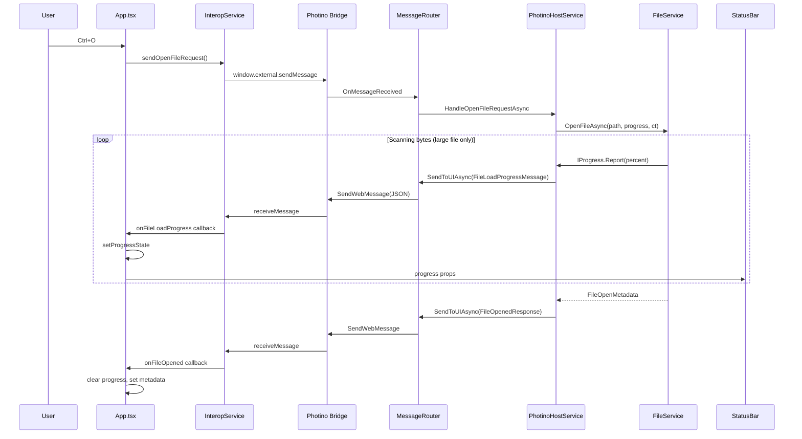
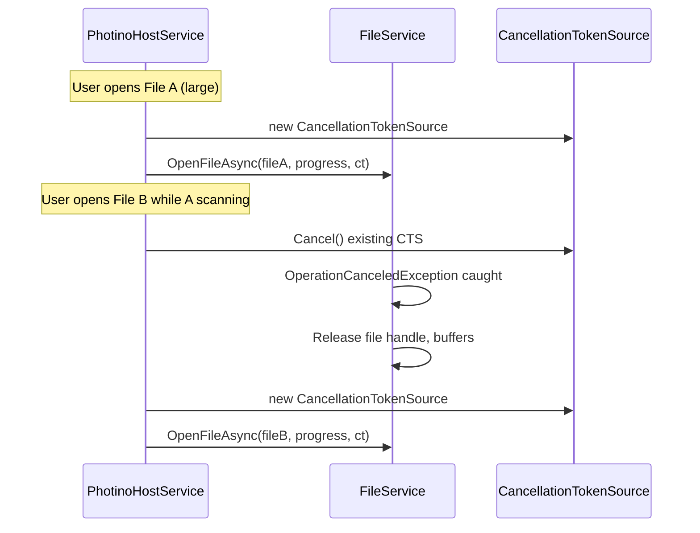

# Design Document: File Load Progress Bar

## Overview

Add progress reporting to `FileService.OpenFileAsync` scanning phase and render a progress bar in the `StatusBar` component for large files (>256,000 bytes). Small files load silently.

**Data flow:** `FileService` scanning loop → `IMessageRouter.SendToUIAsync<FileLoadProgressMessage>` → Photino web message bridge → `InteropService.onFileLoadProgress` callbacks → `StatusBar` renders progress bar.

**Key design decisions:**
- Progress callback injected into `FileService.OpenFileAsync` via `IProgress<FileLoadProgress>` — keeps FileService decoupled from MessageRouter
- `CancellationToken` added to `OpenFileAsync` for graceful cancellation on file switch
- Throttling (50ms) handled inside FileService scanning loop, not in MessageRouter
- Frontend progress state managed in `App.tsx`, passed down to `StatusBar` as props

## Architecture



### Cancellation Flow



## Components and Interfaces

### Backend (C#)

#### FileLoadProgressMessage (new)

New message type in `Models/Messages.cs`:

```csharp
public class FileLoadProgressMessage : IMessage
{
    [JsonPropertyName("fileName")]
    public string FileName { get; set; } = string.Empty;

    [JsonPropertyName("percent")]
    public int Percent { get; set; }

    [JsonPropertyName("fileSizeBytes")]
    public long FileSizeBytes { get; set; }
}
```

#### IFileService changes

Add `CancellationToken` and `IProgress<FileLoadProgress>` to `OpenFileAsync`:

```csharp
public record FileLoadProgress(string FileName, int Percent, long FileSizeBytes);

Task<FileOpenMetadata> OpenFileAsync(
    string filePath,
    IProgress<FileLoadProgress>? progress = null,
    CancellationToken cancellationToken = default);
```

Default params keep backward compat with existing callers.

#### FileService changes

- Add `public const long SizeThresholdBytes = 256_000;` constant
- Modify scanning loop in `OpenFileAsync` to:
  1. Check `fileInfo.Length > SizeThresholdBytes` before reporting progress
  2. Report `percent = 0` at start (large files only)
  3. After each buffer read, calculate `percent = (int)Math.Round((double)totalBytesRead / fileSize * 100)`
  4. Throttle: only report if ≥50ms since last report OR percent changed to 100
  5. Report `percent = 100` at end (large files only)
  6. Check `cancellationToken.ThrowIfCancellationRequested()` each iteration
  7. Wrap stream in `try/finally` to ensure disposal on cancellation

#### PhotinoHostService changes

- Add `CancellationTokenSource? _scanCts` field
- In `HandleOpenFileRequestAsync`:
  1. Cancel existing `_scanCts` if not null → `_scanCts.Cancel(); _scanCts.Dispose();`
  2. Create new `CancellationTokenSource`
  3. Create `Progress<FileLoadProgress>` that sends `FileLoadProgressMessage` via `_messageRouter.SendToUIAsync`
  4. Call `_fileService.OpenFileAsync(filePath, progress, _scanCts.Token)`
  5. Catch `OperationCanceledException` — log, no error sent to UI (new file takes over)

### Frontend (TypeScript/React)

#### InteropService changes

- Add `FileLoadProgressMessage` to `MessageTypes` const
- Add `FileLoadProgressPayload` interface: `{ fileName: string; percent: number; fileSizeBytes: number; }`
- Add `fileLoadProgressCallbacks` array
- Add `onFileLoadProgress(callback)` method to public API
- Add case in `handleMessage` switch for `FileLoadProgressMessage` → invoke callbacks
- Clear `fileLoadProgressCallbacks` in `dispose()`

#### App.tsx changes

- Add state: `const [loadProgress, setLoadProgress] = React.useState<FileLoadProgressPayload | null>(null)`
- Register `interop.onFileLoadProgress` callback → `setLoadProgress(data)`
- When `data.percent === 100` → `setLoadProgress(null)` (hide bar)
- On `onFileOpened` → `setLoadProgress(null)` (clear any lingering progress)
- On `onError` → `setLoadProgress(null)` (hide on error)
- Pass `loadProgress` to `StatusBar` as new prop

#### StatusBar changes

- Add `loadProgress` prop to `StatusBarProps`
- When `loadProgress` is non-null and `loadProgress.percent < 100`:
  - Render progress bar instead of metadata items
  - Progress bar: `<div role="progressbar" aria-valuenow={percent} aria-valuemin={0} aria-valuemax={100}>`
  - Inner fill div with `width: ${percent}%`
  - Text: `Loading: {percent}%`
- When `loadProgress` is null or `percent === 100`: render normal metadata

## Data Models

### New Types

| Type | Location | Fields |
|------|----------|--------|
| `FileLoadProgressMessage` | `Models/Messages.cs` | `fileName: string`, `percent: int (0-100)`, `fileSizeBytes: long` |
| `FileLoadProgress` | `Models/FileModels.cs` | `FileName: string`, `Percent: int`, `FileSizeBytes: long` — record for `IProgress<T>` |
| `FileLoadProgressPayload` | `InteropService.ts` | `fileName: string`, `percent: number`, `fileSizeBytes: number` |

### Modified Types

| Type | Change |
|------|--------|
| `IFileService.OpenFileAsync` | Add `IProgress<FileLoadProgress>?` and `CancellationToken` params |
| `FileService` | Add `SizeThresholdBytes` constant, modify scanning loop |
| `PhotinoHostService` | Add `_scanCts` field, cancellation logic |
| `InteropService` | Add `onFileLoadProgress`, `FileLoadProgressMessage` handling |
| `StatusBarProps` | Add `loadProgress` prop |

### Constants

| Constant | Value | Location |
|----------|-------|----------|
| `SizeThresholdBytes` | `256_000` | `FileService.cs` |
| `ProgressThrottleMs` | `50` | `FileService.cs` (private) |

## Correctness Properties

*A property is a characteristic or behavior that should hold true across all valid executions of a system — essentially, a formal statement about what the system should do. Properties serve as the bridge between human-readable specifications and machine-verifiable correctness guarantees.*

### Property 1: Progress percentage calculation correctness

*For any* pair of values (bytesScanned, totalFileSize) where 0 ≤ bytesScanned ≤ totalFileSize and totalFileSize > 0, the computed percentage SHALL equal `(int)Math.Round((double)bytesScanned / totalFileSize * 100)` and SHALL be an integer in the range [0, 100].

**Validates: Requirements 1.4, 3.3**

### Property 2: Large file progress message sequence integrity

*For any* file with size > 256,000 bytes that completes scanning without error or cancellation, the sequence of progress messages SHALL start with percent = 0 and end with percent = 100, and all intermediate percent values SHALL be monotonically non-decreasing.

**Validates: Requirements 1.1, 1.2, 1.3**

### Property 3: Progress message throttle

*For any* sequence of progress messages emitted during a single file scan, no two consecutive messages SHALL have timestamps less than 50 milliseconds apart (except the final percent=100 message which may be sent immediately).

**Validates: Requirements 1.5**

### Property 4: Small file suppression at threshold boundary

*For any* file with size ≤ 256,000 bytes, the scanning phase SHALL emit exactly zero progress messages. *For any* file with size > 256,000 bytes, the scanning phase SHALL emit at least two progress messages (0% and 100%).

**Validates: Requirements 2.1, 8.1, 8.2**

### Property 5: Progress bar rendering correctness

*For any* integer percent value in [0, 99], the rendered progress bar SHALL have: (a) a fill element with width equal to `percent%`, (b) text content containing `Loading: {percent}%`, (c) `role="progressbar"` attribute, (d) `aria-valuenow` equal to percent, (e) `aria-valuemin="0"`, and (f) `aria-valuemax="100"`.

**Validates: Requirements 4.1, 4.2, 4.3, 4.5**

### Property 6: InteropService dispatches progress to all registered callbacks

*For any* valid `FileLoadProgressMessage` envelope received by the InteropService, all registered `onFileLoadProgress` callbacks SHALL be invoked with the correct payload data, and no other callback types SHALL be invoked.

**Validates: Requirements 6.2**

### Property 7: Error halts progress messages

*For any* error occurring during the scanning phase of a large file, zero progress messages SHALL be emitted after the error point, and the existing `ErrorResponse` message SHALL be sent.

**Validates: Requirements 7.1, 7.3**

### Property 8: Cancellation stops progress and releases resources

*For any* cancellation triggered during the scanning phase (at any byte offset), the FileService SHALL: (a) emit zero further progress messages for the cancelled file, (b) release the file stream handle, and (c) not throw unhandled exceptions.

**Validates: Requirements 9.1, 9.2, 9.4**

## Error Handling

| Scenario | Backend Behavior | Frontend Behavior |
|----------|-----------------|-------------------|
| IOException during scan | Stop progress, send `ErrorResponse` via MessageRouter | Hide progress bar, show error in ContentArea |
| UnauthorizedAccessException | Stop progress, send `ErrorResponse` with `PERMISSION_DENIED` | Hide progress bar, show error |
| OperationCanceledException (file switch) | Swallow exception, log, no ErrorResponse sent | Progress bar replaced by new file's progress (or hidden if new file is small) |
| FileNotFoundException | Stop progress, send `ErrorResponse` with `FILE_NOT_FOUND` | Hide progress bar, show error |
| JSON serialization failure in progress message | Log error, continue scanning (progress is best-effort) | No impact — missed update is acceptable |

**Error handling in PhotinoHostService.HandleOpenFileRequestAsync** already catches all exception types and sends appropriate `ErrorResponse`. The new cancellation path adds a `catch (OperationCanceledException)` block that logs and returns silently (no error to UI since a new file open is taking over).

## Testing Strategy

### Property-Based Tests (C# — using FsCheck or similar)

PBT is appropriate for this feature because the core logic involves:
- Pure calculations (percentage formula)
- Invariants across input ranges (throttle timing, threshold boundary)
- Sequence properties (monotonic progress, start/end values)

**Configuration:** Minimum 100 iterations per property test.

**Tag format:** `Feature: file-load-progress-bar, Property {N}: {title}`

| Property | Test Approach |
|----------|--------------|
| P1: Percentage calculation | Generate random (bytesScanned, totalFileSize) pairs, verify formula and range |
| P2: Message sequence integrity | Generate random large file sizes, mock stream reads, verify first=0, last=100, monotonic |
| P3: Throttle | Generate random byte-read sequences with timestamps, verify ≥50ms between messages |
| P4: Threshold boundary | Generate file sizes around 256,000 (±1), verify zero vs ≥2 messages |
| P5: Progress bar rendering | Generate random percent [0,99], render StatusBar, verify DOM attributes |
| P6: InteropService dispatch | Generate random payloads, register N callbacks, verify all invoked |
| P7: Error halts progress | Generate random error injection points during scan, verify no post-error messages |
| P8: Cancellation cleanup | Cancel at random byte offsets, verify no post-cancel messages and no leaked handles |

### Unit Tests (Example-Based)

| Test | What it verifies |
|------|-----------------|
| Small file (100 bytes) produces no progress | Req 2.1 |
| File exactly at threshold (256,000 bytes) produces no progress | Boundary of Req 8.1 |
| File at threshold+1 (256,001 bytes) produces progress | Boundary of Req 8.1 |
| Progress bar hidden when percent=100 received | Req 4.4 |
| Progress bar hidden on error | Req 7.2 |
| Progress bar hidden on cancellation | Req 9.3 |
| InteropService.dispose() clears progress callbacks | Req 6.3 |
| New file open cancels previous scan | Req 9.1 |
| After cancellation, new file opens normally | Req 9.5 |
| FileLoadProgressMessage has correct JSON field names | Req 3.1, 3.2, 3.4 |
| StatusBar styling: background, fill color, text color, height | Req 5.1–5.4 |

### Integration Tests

| Test | What it verifies |
|------|-----------------|
| End-to-end: open large file → progress messages → FileOpenedResponse | Full pipeline |
| End-to-end: open large file, open another mid-scan → cancellation → new file loads | Cancellation pipeline |
