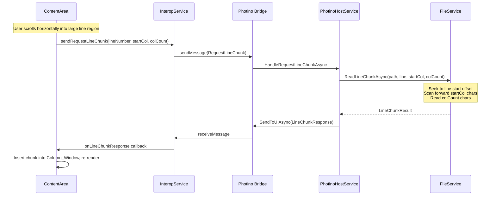
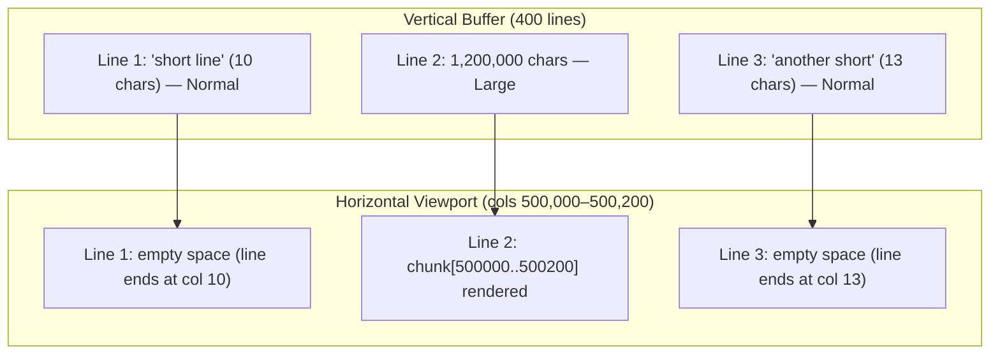
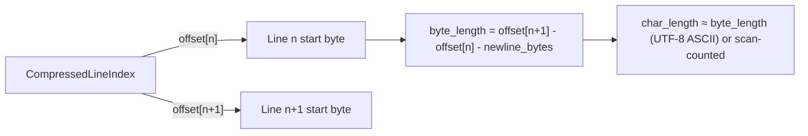
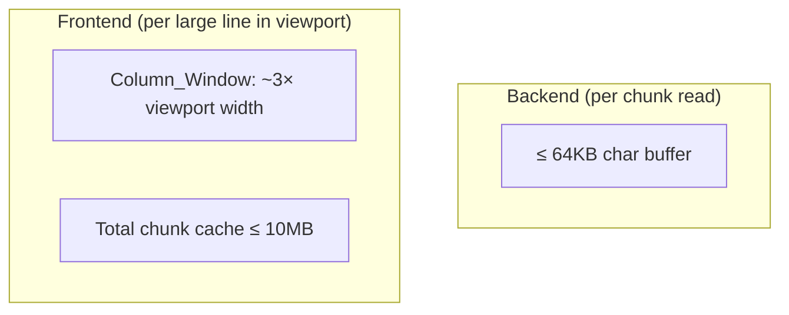

# Design Document: Large Line Support

## Overview

Enable the editor to handle files with arbitrarily long lines (100MB+) without crashing, freezing, or exceeding memory bounds. The solution introduces three coordinated subsystems:

1. **Backend chunked reading** — `FileService` reads large lines in fixed-size character chunks via file seeking, never loading an entire large line into memory.
2. **Chunked message protocol** — New `LineChunkResponse` / `RequestLineChunk` messages deliver line content in pieces, keeping JSON payloads under 4MB.
3. **Frontend horizontal virtualization** — `ContentArea` renders only the visible column range for large lines, fetching chunks on horizontal scroll.

**Key design decisions:**
- **Chunk_Size = 64KB characters** — large enough that all typical source code lines are "normal" (zero overhead), small enough for fast transfer and low memory.
- **Line lengths derived from CompressedLineIndex** — `length = offset[n+1] - offset[n] - newline_bytes`. No separate storage needed for most lines; only the last line requires special handling (use file size as upper bound).
- **UTF-8 character offset resolution** — For variable-width encoding, seek to line start byte offset then scan forward counting characters. Cache a sparse column→byte map for very large lines to avoid repeated full scans.
- **Horizontal scroll range = max line length across vertical buffer** — Matches user expectation that scrollbar reflects longest visible line.
- **Normal lines (< 64KB chars) use existing path unchanged** — `LinesResponse` with full strings, `<pre>` rendering, no horizontal virtualization overhead.

## Architecture

### Chunked Read Flow (Large Line)



### Mixed Line Rendering (Horizontal Virtualization)



### Line Length Derivation



For the last line: `byte_length = file_size - offset[last_line]`.

### Memory Model



## Components and Interfaces

### Backend (C#)

#### New Constants

```csharp
/// <summary>Characters per chunk. Lines below this are "normal".</summary>
public const int ChunkSizeChars = 65_536; // 64KB chars

/// <summary>Max JSON message payload bytes (safety limit).</summary>
public const int MaxMessagePayloadBytes = 4_000_000; // 4MB
```

#### IFileService — New Methods

```csharp
/// <summary>
/// Read a chunk of characters from a specific line.
/// </summary>
/// <param name="filePath">Path to the opened file.</param>
/// <param name="lineNumber">Zero-based line number.</param>
/// <param name="startColumn">Zero-based character offset within the line.</param>
/// <param name="columnCount">Number of characters to read.</param>
/// <returns>The chunk result with text and metadata.</returns>
Task<LineChunkResult> ReadLineChunkAsync(
    string filePath, int lineNumber, int startColumn, int columnCount,
    CancellationToken cancellationToken = default);

/// <summary>
/// Get the character length of a specific line without reading its content.
/// Returns the length from the line length cache (O(1)).
/// </summary>
int GetLineCharLength(string filePath, int lineNumber);
```

#### FileService — ReadLineChunkAsync Implementation

```csharp
public async Task<LineChunkResult> ReadLineChunkAsync(
    string filePath, int lineNumber, int startColumn, int columnCount,
    CancellationToken cancellationToken = default)
{
    if (!_lineIndexCache.TryGetValue(filePath, out var cacheEntry))
        throw new InvalidOperationException($"File has not been opened: {filePath}");

    var index = cacheEntry.Index;
    var lineStartByte = index.GetOffset(lineNumber);
    
    // Determine line byte length
    long lineEndByte;
    if (lineNumber + 1 < index.LineCount)
        lineEndByte = index.GetOffset(lineNumber + 1);
    else
        lineEndByte = cacheEntry.FileSize;
    
    var encoding = cacheEntry.Encoding;
    
    await using var stream = new FileStream(filePath, FileMode.Open, 
        FileAccess.Read, FileShare.ReadWrite, bufferSize: 65536);
    stream.Seek(lineStartByte, SeekOrigin.Begin);
    
    // For UTF-8: scan forward startColumn characters to find byte position
    using var reader = new StreamReader(stream, encoding, 
        detectEncodingFromByteOrderMarks: false, bufferSize: 65536);
    
    // Skip startColumn characters
    var skipBuffer = new char[Math.Min(8192, startColumn)];
    int skipped = 0;
    while (skipped < startColumn)
    {
        var toRead = Math.Min(skipBuffer.Length, startColumn - skipped);
        var read = await reader.ReadAsync(skipBuffer, 0, toRead);
        if (read == 0) break; // End of line reached
        skipped += read;
        cancellationToken.ThrowIfCancellationRequested();
    }
    
    // Read the requested chunk
    var chunkBuffer = new char[Math.Min(columnCount, ChunkSizeChars)];
    int totalRead = 0;
    while (totalRead < chunkBuffer.Length)
    {
        var read = await reader.ReadAsync(chunkBuffer, totalRead, 
            chunkBuffer.Length - totalRead);
        if (read == 0) break;
        totalRead += read;
        cancellationToken.ThrowIfCancellationRequested();
    }
    
    // Trim at newline if we hit end of line
    var text = new string(chunkBuffer, 0, totalRead);
    var newlineIdx = text.IndexOfAny(new[] { '\r', '\n' });
    if (newlineIdx >= 0)
        text = text[..newlineIdx];
    
    var totalLineChars = GetLineCharLength(filePath, lineNumber);
    var hasMore = (startColumn + text.Length) < totalLineChars;
    
    return new LineChunkResult(lineNumber, startColumn, text, totalLineChars, hasMore);
}
```

#### FileService — GetLineCharLength

Line character length is derived from byte offsets. For ASCII/Latin-1 files, `byte_length == char_length`. For UTF-8 with multibyte characters, we must count characters on first access and cache the result.

```csharp
/// <summary>
/// Cache of character lengths for large lines. Key = (filePath, lineNumber).
/// Only populated for lines where byte_length != char_length (multibyte).
/// </summary>
private readonly ConcurrentDictionary<(string, int), int> _charLengthCache = new();

public int GetLineCharLength(string filePath, int lineNumber)
{
    if (!_lineIndexCache.TryGetValue(filePath, out var cacheEntry))
        throw new InvalidOperationException($"File has not been opened: {filePath}");

    var index = cacheEntry.Index;
    long lineStartByte = index.GetOffset(lineNumber);
    long lineEndByte = (lineNumber + 1 < index.LineCount)
        ? index.GetOffset(lineNumber + 1)
        : cacheEntry.FileSize;
    
    // Subtract newline bytes (estimate: 1 for LF, 2 for CRLF)
    // Actual newline detection done during scan — store in metadata
    long byteLength = lineEndByte - lineStartByte;
    
    // For single-byte encodings, byte_length == char_length (minus newline)
    var encoding = cacheEntry.Encoding;
    if (encoding.IsSingleByte || encoding is UTF8Encoding)
    {
        // For UTF-8: optimistic — assume ASCII. If line was flagged as
        // multibyte during scan, use cached char length.
        if (_charLengthCache.TryGetValue((filePath, lineNumber), out var cached))
            return cached;
        
        // Approximate: byte_length minus newline bytes
        // Newline is 1 byte (LF) or 2 bytes (CRLF) — we subtract conservatively
        return (int)Math.Max(0, byteLength - 2);
    }
    
    // For fixed-width multi-byte (UTF-16, UTF-32)
    int bytesPerChar = encoding.GetMaxByteCount(1);
    return (int)(byteLength / bytesPerChar);
}
```

#### FileService — Modified ReadLinesAsync for Large Lines

When `ReadLinesAsync` encounters a large line, it returns a truncated preview (first ChunkSizeChars characters) and includes line length metadata in the response.

```csharp
// Inside ReadLinesAsync loop:
for (int i = 0; i < lineCount; i++)
{
    cancellationToken.ThrowIfCancellationRequested();
    var lineText = await reader.ReadLineAsync(cancellationToken) ?? string.Empty;
    
    if (lineText.Length > ChunkSizeChars)
    {
        // Large line — truncate to first chunk, mark in metadata
        lines[i] = lineText[..ChunkSizeChars];
        lineLengths[i] = lineText.Length; // actual char count from ReadLine
        // Cache the char length for future chunk requests
        _charLengthCache[(filePath, startLine + i)] = lineText.Length;
    }
    else
    {
        lines[i] = lineText;
        lineLengths[i] = lineText.Length;
    }
}
```

**Problem:** This still reads the entire line via `ReadLineAsync` for the first batch. For truly huge lines (100MB+), we need a different approach:

**Solution:** Check line byte length from index *before* reading. If `byteLength > ChunkSizeChars * avgBytesPerChar`, use chunked read instead of `ReadLineAsync`:

```csharp
for (int i = 0; i < lineCount; i++)
{
    cancellationToken.ThrowIfCancellationRequested();
    int currentLine = startLine + i;
    long lineByteLen = GetLineByteLength(index, currentLine, cacheEntry.FileSize);
    
    if (lineByteLen > ChunkSizeChars * 2) // Conservative threshold
    {
        // Large line — read only first chunk via seek
        var chunk = await ReadLineChunkAsync(filePath, currentLine, 0, ChunkSizeChars, cancellationToken);
        lines[i] = chunk.Text;
        lineLengths[i] = chunk.TotalLineChars;
    }
    else
    {
        // Normal line — use StreamReader as before
        var lineText = await reader.ReadLineAsync(cancellationToken) ?? string.Empty;
        lines[i] = lineText;
        lineLengths[i] = lineText.Length;
    }
}
```

#### New Message Types

```csharp
/// <summary>
/// Request from frontend for a chunk of a large line.
/// </summary>
public class RequestLineChunk : IMessage
{
    [JsonPropertyName("lineNumber")]
    public int LineNumber { get; set; }

    [JsonPropertyName("startColumn")]
    public int StartColumn { get; set; }

    [JsonPropertyName("columnCount")]
    public int ColumnCount { get; set; }
}

/// <summary>
/// Response with a chunk of line content.
/// </summary>
public class LineChunkResponse : IMessage
{
    [JsonPropertyName("lineNumber")]
    public int LineNumber { get; set; }

    [JsonPropertyName("startColumn")]
    public int StartColumn { get; set; }

    [JsonPropertyName("text")]
    public string Text { get; set; } = string.Empty;

    [JsonPropertyName("totalLineChars")]
    public int TotalLineChars { get; set; }

    [JsonPropertyName("hasMore")]
    public bool HasMore { get; set; }
}
```

#### Modified LinesResponse

```csharp
/// <summary>
/// Extended LinesResponse that includes per-line character lengths.
/// </summary>
public class LinesResponse : IMessage
{
    [JsonPropertyName("startLine")]
    public int StartLine { get; set; }

    [JsonPropertyName("lines")]
    public string[] Lines { get; set; } = Array.Empty<string>();

    [JsonPropertyName("totalLines")]
    public int TotalLines { get; set; }

    /// <summary>
    /// Character length of each line. For normal lines, equals Lines[i].Length.
    /// For large lines, indicates total line length (Lines[i] is truncated to first chunk).
    /// Null when all lines are normal (backward compat).
    /// </summary>
    [JsonPropertyName("lineLengths")]
    public int[]? LineLengths { get; set; }
}
```

#### PhotinoHostService — New Handler

```csharp
_messageRouter.RegisterHandler<RequestLineChunk>(HandleRequestLineChunkAsync);

private async Task HandleRequestLineChunkAsync(RequestLineChunk request)
{
    if (string.IsNullOrEmpty(_currentFilePath))
    {
        await _messageRouter.SendToUIAsync(new ErrorResponse
        {
            ErrorCode = ErrorCode.UNKNOWN_ERROR.ToString(),
            Message = "No file is currently open."
        });
        return;
    }

    var result = await _fileService.ReadLineChunkAsync(
        _currentFilePath, request.LineNumber, request.StartColumn, request.ColumnCount);

    await _messageRouter.SendToUIAsync(new LineChunkResponse
    {
        LineNumber = result.LineNumber,
        StartColumn = result.StartColumn,
        Text = result.Text,
        TotalLineChars = result.TotalLineChars,
        HasMore = result.HasMore
    });
}
```

### Frontend (TypeScript/React)

#### InteropService — New Messages

```typescript
// New message types
const MessageTypes = {
  // ... existing ...
  RequestLineChunk: 'RequestLineChunk',
  LineChunkResponse: 'LineChunkResponse',
} as const;

interface LineChunkPayload {
  lineNumber: number;
  startColumn: number;
  text: string;
  totalLineChars: number;
  hasMore: boolean;
}

interface LinesResponsePayload {
  startLine: number;
  lines: string[];
  totalLines: number;
  lineLengths?: number[]; // NEW — null when all normal
}

// New methods on InteropService
interface InteropService {
  // ... existing ...
  sendRequestLineChunk(lineNumber: number, startColumn: number, columnCount: number): void;
  onLineChunkResponse(callback: (data: LineChunkPayload) => void): void;
}
```

#### ContentArea — Horizontal Virtualization

New constants:
```typescript
/** Characters visible in horizontal viewport (monospace). */
const H_VIEWPORT_CHARS = 200;

/** Column window buffer: chars loaded ahead/behind viewport. */
const H_WINDOW_CHARS = 600;

/** Threshold: lines with more chars than this are "large". */
const LARGE_LINE_THRESHOLD = 65_536;

/** Max total chunk cache memory (chars across all lines). */
const MAX_CHUNK_CACHE_CHARS = 10_000_000 / 2; // ~10MB at 2 bytes/char
```

New state:
```typescript
// Horizontal scroll position (column offset)
const [hScrollCol, setHScrollCol] = React.useState(0);

// Per-line chunk cache: Map<lineNumber, { startCol, text }>
const chunkCacheRef = React.useRef<Map<number, { startCol: number; text: string }>>(new Map());

// Line lengths from LinesResponse (null = all normal)
const [lineLengths, setLineLengths] = React.useState<number[] | null>(null);
```

Rendering logic for a large line:
```typescript
function renderLine(line: string, lineIndex: number, lineNumber: number) {
  const lineLength = lineLengths?.[lineIndex] ?? line.length;
  const isLarge = lineLength > LARGE_LINE_THRESHOLD;
  
  if (!isLarge || wrapLines) {
    // Normal rendering — existing <pre> approach
    return <pre className="content-line" ...>{line}</pre>;
  }
  
  // Horizontal virtualization for large line
  const visibleStart = hScrollCol;
  const visibleEnd = Math.min(hScrollCol + H_VIEWPORT_CHARS, lineLength);
  const cached = chunkCacheRef.current.get(lineNumber);
  
  let visibleText = '';
  if (cached && cached.startCol <= visibleStart && 
      cached.startCol + cached.text.length >= visibleEnd) {
    // Cache hit — extract visible portion
    const offset = visibleStart - cached.startCol;
    visibleText = cached.text.slice(offset, offset + (visibleEnd - visibleStart));
  } else {
    // Cache miss — show placeholder, request chunk
    visibleText = ' '.repeat(visibleEnd - visibleStart);
    requestChunk(lineNumber, visibleStart);
  }
  
  return (
    <pre className="content-line content-line--large" style={{
      whiteSpace: 'pre',
      margin: 0, flex: 1, minWidth: 0,
    }}>
      {visibleText}
    </pre>
  );
}
```

#### Horizontal Scrollbar

The horizontal scroll range = `Math.max(...lineLengths)` across all buffered lines. Rendered as a native-style scrollbar below the content area (or reuse `CustomScrollbar` rotated).

```typescript
// Compute max line length across vertical buffer
const maxLineLength = React.useMemo(() => {
  if (!lineLengths) return 0;
  return Math.max(0, ...lineLengths);
}, [lineLengths]);

// Horizontal scrollbar (only when word-wrap disabled and maxLineLength > viewport)
{!wrapLines && maxLineLength > H_VIEWPORT_CHARS && (
  <div className="horizontal-scrollbar-container">
    <input
      type="range"
      min={0}
      max={maxLineLength - H_VIEWPORT_CHARS}
      value={hScrollCol}
      onChange={(e) => setHScrollCol(Number(e.target.value))}
      className="horizontal-scrollbar"
    />
  </div>
)}
```

#### Chunk Cache Management

```typescript
function onChunkReceived(chunk: LineChunkPayload) {
  const cache = chunkCacheRef.current;
  cache.set(chunk.lineNumber, { startCol: chunk.startColumn, text: chunk.text });
  
  // Evict if total cache exceeds limit
  let totalChars = 0;
  for (const entry of cache.values()) totalChars += entry.text.length;
  if (totalChars > MAX_CHUNK_CACHE_CHARS) {
    // Evict entries furthest from current viewport
    // ... LRU eviction logic ...
  }
  
  // Trigger re-render
  forceUpdate();
}
```

#### Vertical Scroll-Out Cleanup

When lines leave the vertical buffer, their chunk cache entries are released:
```typescript
React.useEffect(() => {
  const cache = chunkCacheRef.current;
  for (const lineNum of cache.keys()) {
    if (lineNum < linesStartLine || lineNum >= linesStartLine + (lines?.length ?? 0)) {
      cache.delete(lineNum);
    }
  }
}, [linesStartLine, lines]);
```

## Data Models

### New Records (C#)

```csharp
/// <summary>
/// Result of reading a chunk from a large line.
/// </summary>
public record LineChunkResult(
    int LineNumber, 
    int StartColumn, 
    string Text, 
    int TotalLineChars, 
    bool HasMore);
```

### New Message Types

| Type | Direction | Fields |
|------|-----------|--------|
| `RequestLineChunk` | Frontend → Backend | `lineNumber`, `startColumn`, `columnCount` |
| `LineChunkResponse` | Backend → Frontend | `lineNumber`, `startColumn`, `text`, `totalLineChars`, `hasMore` |

### Modified Types

| Type | Change |
|------|--------|
| `LinesResponse` | Add optional `lineLengths: int[]?` field |
| `LinesResponsePayload` (TS) | Add optional `lineLengths?: number[]` field |
| `CacheEntry` | Unchanged — line lengths derived from `CompressedLineIndex` offsets |

### New Frontend State

| Component | State | Type | Purpose |
|-----------|-------|------|---------|
| `ContentArea` | `hScrollCol` | `number` | Current horizontal scroll column |
| `ContentArea` | `chunkCacheRef` | `Map<number, {startCol, text}>` | Cached chunks per line |
| `ContentArea` | `lineLengths` | `number[] \| null` | Per-line char lengths from backend |

### Constants

| Constant | Value | Location | Purpose |
|----------|-------|----------|---------|
| `ChunkSizeChars` | `65,536` | `FileService.cs` | Max chars per chunk / large line threshold |
| `MaxMessagePayloadBytes` | `4,000,000` | `FileService.cs` | JSON message size limit |
| `LARGE_LINE_THRESHOLD` | `65,536` | `ContentArea.tsx` | Frontend large line detection |
| `H_VIEWPORT_CHARS` | `200` | `ContentArea.tsx` | Visible horizontal chars |
| `H_WINDOW_CHARS` | `600` | `ContentArea.tsx` | Column window buffer size |
| `MAX_CHUNK_CACHE_CHARS` | `5,000,000` | `ContentArea.tsx` | Max cached chars (~10MB) |


## Correctness Properties

*A property is a characteristic or behavior that should hold true across all valid executions of a system — essentially, a formal statement about what the system should do. Properties serve as the bridge between human-readable specifications and machine-verifiable correctness guarantees.*

### Property 1: Chunk read returns at most ChunkSizeChars characters

*For any* file with a large line (> ChunkSizeChars characters), and *for any* valid `(lineNumber, startColumn, columnCount)` request where `columnCount` may exceed ChunkSizeChars, the `ReadLineChunkAsync` result text SHALL have length ≤ ChunkSizeChars.

**Validates: Requirements 1.3, 6.1**

### Property 2: ReadLinesAsync truncates large lines and provides length metadata

*For any* file containing a mix of normal and large lines, and *for any* valid `(startLine, lineCount)` request, the `LinesResponse` SHALL satisfy: (a) for each line where actual char length > ChunkSizeChars, the returned string has length ≤ ChunkSizeChars, (b) `lineLengths[i]` equals the actual character length of line `startLine + i` for all i, and (c) `lineLengths` is non-null when at least one line in the range is large.

**Validates: Requirements 1.4, 3.2**

### Property 3: ReadLineChunkAsync returns correct substring

*For any* file with known content, and *for any* valid `(lineNumber, startColumn, columnCount)` where `startColumn + columnCount ≤ lineCharLength`, the text returned by `ReadLineChunkAsync` SHALL equal the substring of that line from `startColumn` to `startColumn + text.Length`.

**Validates: Requirements 8.1, 8.2**

### Property 4: Line byte length derived from CompressedLineIndex equals actual

*For any* file with arbitrary content and line endings, after `OpenFileAsync` completes, the byte length derived from consecutive offsets in the CompressedLineIndex (`offset[n+1] - offset[n]`) SHALL equal the actual byte length of line n (including its line ending bytes) for all lines except the last, where `fileSize - offset[last]` is used.

**Validates: Requirements 2.1**

### Property 5: Horizontal scroll range equals max line length

*For any* array of line lengths (from `lineLengths` in `LinesResponse`), the computed horizontal scroll range SHALL equal `Math.max(...lineLengths)`. When `lineLengths` changes due to vertical buffer update, the scroll range SHALL immediately reflect the new maximum.

**Validates: Requirements 4.5, 5.1, 5.5**

### Property 6: Only large lines trigger chunk requests; short lines render empty

*For any* vertical buffer containing a mix of normal and large lines, and *for any* horizontal scroll position `hScrollCol`, chunk requests SHALL be issued only for lines where `lineLength > LARGE_LINE_THRESHOLD` AND `hScrollCol < lineLength`. Lines where `lineLength ≤ hScrollCol` SHALL render as empty space with no chunk request.

**Validates: Requirements 4.6, 5.4**

### Property 7: All-normal files use existing LinesResponse with no chunking overhead

*For any* file where all lines have character length ≤ ChunkSizeChars, `ReadLinesAsync` SHALL return full line strings (not truncated), and `lineLengths` SHALL be null, preserving backward-compatible behavior.

**Validates: Requirements 7.1**

### Property 8: Chunk cache evicts entries for lines outside vertical buffer

*For any* sequence of vertical buffer changes (linesStartLine, lines.length), after each change the chunk cache SHALL contain entries only for line numbers within `[linesStartLine, linesStartLine + lines.length)`.

**Validates: Requirements 6.3**

### Property 9: Total chunk cache size bounded

*For any* sequence of chunk arrivals, the total number of characters stored across all entries in the chunk cache SHALL NOT exceed `MAX_CHUNK_CACHE_CHARS`. When a new chunk would exceed the limit, the cache SHALL evict entries until the limit is satisfied.

**Validates: Requirements 6.4**

### Property 10: Search detects matches at chunk boundaries via overlap

*For any* large line and *for any* search term of length L placed such that it spans a chunk boundary (starts within `[chunkEnd - L + 1, chunkEnd]`), the chunked search algorithm SHALL detect the match by reading overlapping regions of at least L characters between consecutive chunks.

**Validates: Requirements 10.3**

### Property 11: Serialized LineChunkResponse size bounded

*For any* `LineChunkResponse` message where `text.Length ≤ ChunkSizeChars`, the JSON-serialized `MessageEnvelope` containing that response SHALL have byte length < `MaxMessagePayloadBytes` (4MB).

**Validates: Requirements 3.4**

### Property 12: Chunked search finds all occurrences in large lines

*For any* large line containing N occurrences of a search term at known positions, the chunked search SHALL report exactly N matches with correct column offsets.

**Validates: Requirements 10.1**

## Error Handling

| Scenario | Backend Behavior | Frontend Behavior |
|----------|-----------------|-------------------|
| `ReadLineChunkAsync` with invalid lineNumber | Throw `ArgumentOutOfRangeException` → `HandleRequestLineChunkAsync` catches, sends `ErrorResponse` | Show error toast, keep existing content |
| `ReadLineChunkAsync` with startColumn beyond line end | Return empty text with `hasMore = false` | No-op, render empty space |
| IOException during chunk read (file deleted/moved) | Throw `FileNotFoundException` → handler sends `ErrorResponse` with `FILE_NOT_FOUND` | Show error, clear file state |
| Chunk request for file not in cache | Throw `InvalidOperationException` → handler sends `ErrorResponse` | Show "no file open" error |
| JSON serialization exceeds 4MB (shouldn't happen with ChunkSizeChars limit) | Log error, send `ErrorResponse` with `INTEROP_FAILURE` | Show generic error |
| UTF-8 decoding error mid-line (invalid byte sequence) | `StreamReader` replaces with U+FFFD, chunk returned with replacement chars | Display replacement characters |
| Concurrent chunk requests for same line | Both complete independently — last response wins in cache | Cache updated, re-render shows latest |
| Horizontal scroll during chunk fetch (stale request) | Response arrives, cache updated | If scroll moved past response range, ignore visually (cache still updated for future) |
| Copy selection requires chunks not in cache | Frontend shows loading indicator, requests chunks | Clipboard write deferred until all chunks arrive; timeout after 10s → show error |
| Search in large line — file modified during search | Stale detection fires → refresh cycle | Search results may be invalidated; user re-searches after refresh |

## Testing Strategy

### Property-Based Tests (C# — FsCheck 3.1.0)

PBT is appropriate for this feature because:
- Core logic involves pure functions (byte offset derivation, chunk extraction, substring correctness)
- Universal invariants (memory bounds, truncation rules, backward compatibility)
- Input space is large (arbitrary file contents, line lengths, column offsets, encodings)
- Chunk boundary search requires exhaustive edge case coverage

**Configuration:** Minimum 100 iterations per property test.
**Tag format:** `Feature: large-line-support, Property {N}: {title}`

| Property | Test Approach |
|----------|--------------|
| P1: Chunk size bound | Generate random large lines (64KB–10MB chars). Request chunks with random columnCount (including values > ChunkSizeChars). Verify `result.Text.Length ≤ ChunkSizeChars`. |
| P2: Truncation + metadata | Generate files with random mix of normal/large lines. Call ReadLinesAsync. Verify truncation and lineLengths correctness. |
| P3: Chunk correctness | Generate files with known content. Request chunks at random offsets. Verify text matches expected substring. |
| P4: Byte length derivation | Generate random file content with mixed line endings (\n, \r\n, \r). Open file. Verify derived byte lengths match actual. |
| P7: Backward compat | Generate files with all lines < ChunkSizeChars. Call ReadLinesAsync. Verify full strings returned, lineLengths null. |
| P10: Chunk boundary search | Generate large lines with search terms placed at chunk boundaries. Run chunked search. Verify all found. |
| P11: Message size bound | Generate LineChunkResponse with random text up to ChunkSizeChars. Serialize. Verify < 4MB. |
| P12: Search completeness | Generate large lines with known embedded terms. Run chunked search. Verify all N occurrences found with correct offsets. |

### Property-Based Tests (Frontend — fast-check)

| Property | Test Approach |
|----------|--------------|
| P5: Scroll range = max | Generate random lineLengths arrays. Compute maxLineLength. Verify equals Math.max(...lineLengths). |
| P6: Chunk request targeting | Generate mixed lineLengths + random hScrollCol. Verify chunk requests fire only for qualifying large lines. |
| P8: Cache eviction | Generate sequence of (linesStartLine, lineCount) changes. Verify cache only contains in-range entries after each change. |
| P9: Cache size bound | Generate sequence of chunk arrivals with random sizes. Verify total cache chars ≤ MAX_CHUNK_CACHE_CHARS after each insertion. |

### Unit Tests (Example-Based)

| Test | What it verifies |
|------|-----------------|
| ReadLineChunkAsync: line with exactly ChunkSizeChars → returns full line, hasMore=false | Boundary of Req 1.3 |
| ReadLineChunkAsync: line with ChunkSizeChars+1 → first chunk has ChunkSizeChars, hasMore=true | Boundary of Req 1.1 |
| ReadLineChunkAsync: startColumn=0, columnCount=10 on 1M char line → returns first 10 chars | Req 8.1 |
| ReadLineChunkAsync: startColumn at end of line → returns empty, hasMore=false | Edge case |
| ReadLinesAsync: batch of 5 lines, 2 large → lineLengths non-null, large lines truncated | Req 1.4 |
| ReadLinesAsync: batch of 5 normal lines → lineLengths null, full strings | Req 7.1 |
| GetLineCharLength: ASCII file → byte length - newline bytes | Req 2.3 |
| GetLineCharLength: UTF-8 file with multibyte chars → correct char count | Req 2.3, 8.2 |
| LineChunkResponse JSON contains all required fields | Req 3.1 |
| RequestLineChunk round-trip: send request → receive response with correct data | Req 3.3 |
| ContentArea: all normal lines → no horizontal scrollbar rendered | Req 7.2 |
| ContentArea: large line at hScrollCol=0 → renders first H_VIEWPORT_CHARS | Req 4.1 |
| ContentArea: cache miss → placeholder spaces rendered | Req 4.4 |
| ContentArea: horizontal scrollbar drag to 50% → hScrollCol = maxLineLength/2 | Req 5.3 |
| Copy: selection within cached range → immediate clipboard write | Req 9.1 |
| Copy: selection beyond cache → loading indicator shown, chunks requested | Req 9.3 |
| Search: match at column 500,000 → hScrollCol updated to show match | Req 10.2 |
| ChunkSizeChars constant ≥ 65,536 | Req 7.3 |

### Integration Tests

| Test | What it verifies |
|------|-----------------|
| End-to-end: open file with 1M char line → LinesResponse has truncated line + lineLengths → frontend requests chunk → chunk arrives → renders correctly | Full pipeline |
| End-to-end: horizontal scroll from col 0 to col 500,000 → chunk requests fire → content updates smoothly | Scroll pipeline |
| End-to-end: search term at chunk boundary in 10M char line → found and highlighted | Search pipeline |
| End-to-end: copy 200KB selection from large line → multiple chunks assembled → clipboard correct | Copy pipeline |
| End-to-end: file with mix of 15-char and 1M-char lines → horizontal scrollbar range = 1M, short lines show empty at col 500K | Mixed line scenario |
