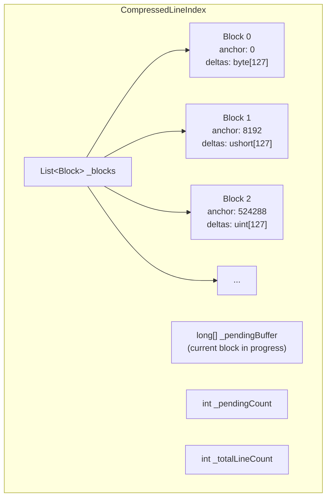
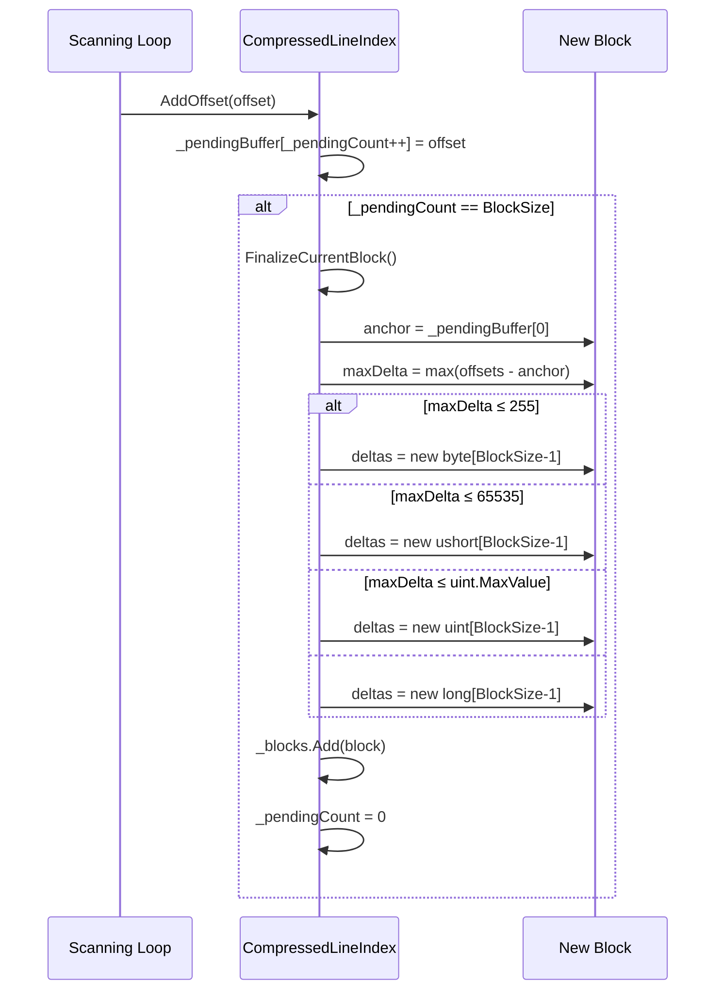
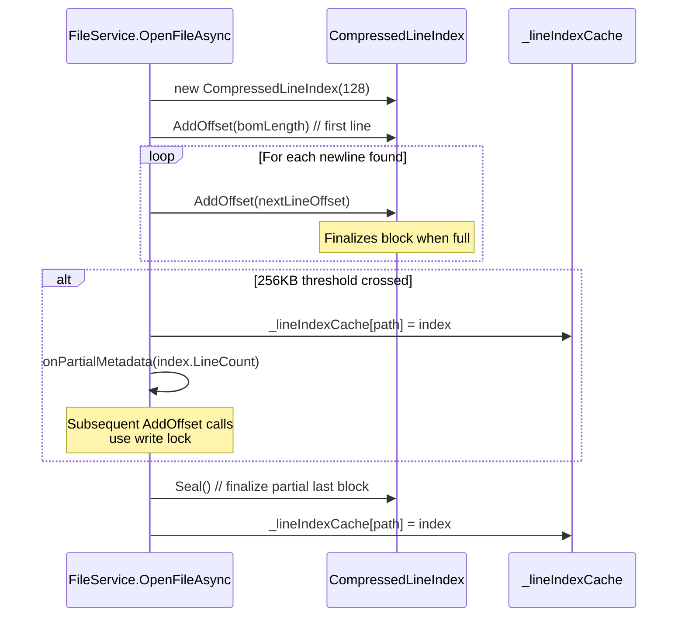
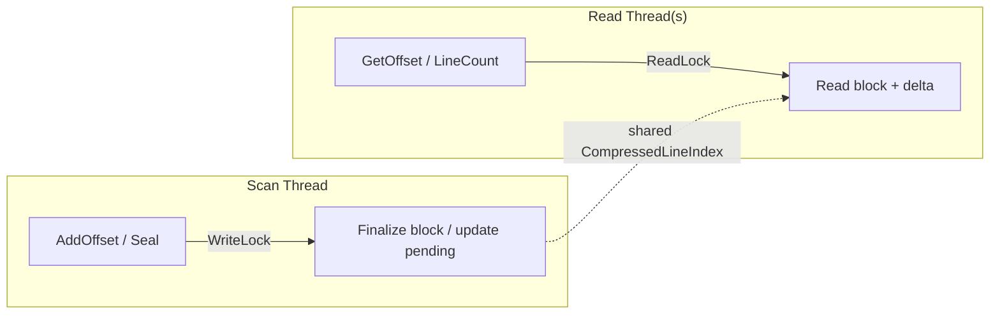

# Design Document: Block-Based Compressed Line Index

## Overview

Replace the flat `List<long>` line offset index in `FileService` with a block-based compressed index that uses delta encoding. The current index stores one 8-byte `long` per line — 80 MB for a 10M-line file. The compressed index groups lines into fixed-size blocks (default 128), stores one absolute anchor offset per block, and encodes the remaining offsets as deltas using the narrowest integer type that fits (`byte`, `ushort`, `uint`, or `long`). This yields 70–90% memory savings for typical source files.

**Core design decisions:**

- **New `CompressedLineIndex` class** replaces `List<long>` in `_lineIndexCache`. Encapsulates all block/delta logic behind a clean API: `AddOffset(long)`, `GetOffset(int lineNumber)`, `LineCount`, `Seal()`.
- **Incremental construction** — offsets accumulate in a small temporary buffer (`long[BlockSize]`). When the buffer fills, a block is finalized (deltas computed, narrowest type selected, array allocated). No second pass needed; the flat list is never fully materialized.
- **O(1) lookup** — block index = `lineNumber / BlockSize`, intra-block position = `lineNumber % BlockSize`. If position is 0, return anchor directly. Otherwise, return anchor + delta.
- **Thread safety** — `ReaderWriterLockSlim` on the `CompressedLineIndex` instance. Scanning thread takes write lock only to finalize a block (fast — one array copy). `ReadLinesAsync` takes read lock to snapshot offset. Multiple concurrent readers allowed.
- **Transparent integration** — `IFileService` signatures unchanged. `_lineIndexCache` type changes from `Dictionary<string, List<long>>` to `Dictionary<string, CompressedLineIndex>`. `ReadLinesAsync` calls `index.GetOffset(startLine)` instead of `lineOffsets[startLine]`.
- **Partial index compatibility** — during scanning, `LineCount` includes both finalized blocks and the in-progress buffer. `GetOffset` works for any line indexed so far (finalized blocks use delta lookup; in-progress buffer uses direct `long` access).
- **Block size as constant** — `CompressedLineIndex.DefaultBlockSize = 128`. Constructor accepts block size parameter, validated as power-of-2 in [32, 1024].

## Architecture

### CompressedLineIndex Internal Structure



### Block Finalization Flow



### Integration with FileService Scanning



### Thread Safety Model



Before the partial metadata threshold, no locking is needed (single-threaded construction). After the threshold, the index is published to the cache and concurrent reads become possible. At that point, `AddOffset` acquires a write lock and `GetOffset`/`LineCount` acquire read locks.

## Components and Interfaces

### CompressedLineIndex — New Class

```csharp
namespace EditorApp.Services;

/// <summary>
/// Memory-efficient line offset index using block-based delta encoding.
/// Groups line offsets into fixed-size blocks. Each block stores one absolute
/// anchor offset and delta-encoded offsets for remaining lines using the
/// narrowest integer type that fits.
/// </summary>
public sealed class CompressedLineIndex
{
    public const int DefaultBlockSize = 128;

    // Construction
    public CompressedLineIndex(int blockSize = DefaultBlockSize);
    public void AddOffset(long offset);
    public void Seal();

    // Queries
    public int LineCount { get; }
    public long GetOffset(int lineNumber);
    public int BlockSize { get; }

    // Thread safety — caller enables after publishing to cache
    public void EnableConcurrentAccess();
}
```

**Internal types:**

```csharp
/// <summary>
/// Discriminated union tag for the delta array type within a block.
/// </summary>
internal enum DeltaType : byte { Byte, UShort, UInt, Long }

/// <summary>
/// A finalized block of line offsets. Stores one anchor and a typed delta array.
/// </summary>
internal readonly struct Block
{
    public readonly long Anchor;
    public readonly Array Deltas;      // byte[], ushort[], uint[], or long[]
    public readonly DeltaType Type;
    public readonly int Count;         // number of lines in this block (BlockSize or less for last block)
}
```

### FileService — Modified Internals

```csharp
// BEFORE
private readonly Dictionary<string, List<long>> _lineIndexCache = new();

// AFTER
private readonly Dictionary<string, CompressedLineIndex> _lineIndexCache = new();
```

**`OpenFileAsync` changes:**
1. Create `var index = new CompressedLineIndex()` instead of `var lineOffsets = new List<long>()`.
2. Replace `lineOffsets.Add(offset)` with `index.AddOffset(offset)`.
3. At partial threshold: call `index.EnableConcurrentAccess()`, then store in cache under `_indexLock`.
4. After scan loop: call `index.Seal()` to finalize the last partial block.
5. Remove the trailing-offset cleanup logic (the `CompressedLineIndex.Seal()` handles it).
6. `totalLines = index.LineCount`.

**`ReadLinesAsync` changes:**
```csharp
lock (_indexLock)
{
    if (!_lineIndexCache.TryGetValue(filePath, out var index))
        throw new InvalidOperationException($"File has not been opened: {filePath}");

    snapshotCount = index.LineCount;
    if (startLine < 0) startLine = 0;
    if (startLine >= snapshotCount)
        return new LinesResult(startLine, Array.Empty<string>(), snapshotCount);

    var clampedCount = Math.Min(lineCount, snapshotCount - startLine);
    if (clampedCount <= 0)
        return new LinesResult(startLine, Array.Empty<string>(), snapshotCount);

    startOffset = index.GetOffset(startLine);
    lineCount = clampedCount;
}
```

The `_indexLock` (existing `object` lock) continues to protect the `_lineIndexCache` dictionary. The `CompressedLineIndex` instance uses its own internal `ReaderWriterLockSlim` for concurrent access to blocks and pending buffer.

### IFileService — Unchanged

No changes to `IFileService`. Method signatures and return types remain identical.

### FileModels — Unchanged

`FileOpenMetadata`, `LinesResult`, `FileLoadProgress`, `FileOpenResult` — all unchanged.

## Data Models

### New Types

| Type | Location | Description |
|------|----------|-------------|
| `CompressedLineIndex` | `Services/CompressedLineIndex.cs` | Block-based delta-encoded line offset index |
| `DeltaType` | `Services/CompressedLineIndex.cs` (internal) | Enum: `Byte`, `UShort`, `UInt`, `Long` |
| `Block` | `Services/CompressedLineIndex.cs` (internal) | Struct: anchor + typed delta array + count |

### Modified Types

| Type | Change |
|------|--------|
| `FileService._lineIndexCache` | Value type changes from `List<long>` to `CompressedLineIndex` |

### Unchanged Types

| Type | Why unchanged |
|------|---------------|
| `IFileService` | Signatures preserved (Req 5.2, 6.2) |
| `FileOpenMetadata` | Return type preserved (Req 6.2) |
| `LinesResult` | Return type preserved (Req 5.2) |
| `FileLoadProgress` | Unrelated to index format |

### Memory Layout Comparison

**Flat Index (current):** 10M lines × 8 bytes = 80 MB

**Compressed Index (new):** 10M lines, block size 128, average line length 60 bytes:
- Blocks: 10M / 128 = 78,125 blocks
- Anchors: 78,125 × 8 bytes = 625 KB
- Deltas per block: 127 entries. Max delta ≈ 127 × 60 = 7,620 → fits in `ushort` (2 bytes)
- Delta arrays: 78,125 × 127 × 2 bytes = ~19 MB
- Block struct overhead: 78,125 × ~32 bytes = ~2.4 MB
- **Total: ~22 MB** (72% reduction)

For short lines (avg 30 bytes): max delta ≈ 3,810 → `ushort`, total ~12 MB (85% reduction).
For very short lines (avg 10 bytes): max delta ≈ 1,270 → `ushort`, total ~12 MB. But many blocks will fit in `byte` (max delta < 256 when avg < 2 bytes per line — rare).

### Constants

| Constant | Value | Location |
|----------|-------|----------|
| `CompressedLineIndex.DefaultBlockSize` | `128` | `CompressedLineIndex.cs` |
| `SizeThresholdBytes` | `256_000` | `FileService.cs` (unchanged) |

## Correctness Properties

*A property is a characteristic or behavior that should hold true across all valid executions of a system — essentially, a formal statement about what the system should do. Properties serve as the bridge between human-readable specifications and machine-verifiable correctness guarantees.*

### Property 1: Round-trip offset equivalence across block sizes

*For any* monotonically increasing sequence of `long` offsets (representing line start positions), and *for any* valid block size (power of 2 in [32, 1024]), building a `CompressedLineIndex` by calling `AddOffset` for each offset and then `Seal()`, the index SHALL satisfy: (a) `LineCount` equals the number of offsets added, and (b) `GetOffset(i)` returns the original offset for every valid line number `i` in `[0, LineCount)`.

**Validates: Requirements 9.1, 9.2, 1.5, 6.3, 7.1, 10.3**

### Property 2: Narrowest delta type selection

*For any* block of offsets where the first offset is the anchor, the `CompressedLineIndex` SHALL select the delta storage type as follows: if the maximum delta (max offset − anchor) fits in 8 bits (`≤ 255`), use `byte`; if it fits in 16 bits (`≤ 65,535`), use `ushort`; if it fits in 32 bits (`≤ 4,294,967,295`), use `uint`; otherwise use `long`. No wider type SHALL be used when a narrower type suffices.

**Validates: Requirements 1.4**

### Property 3: Memory efficiency by delta range

*For any* monotonically increasing offset sequence of at least 1,000 lines where all consecutive deltas are less than 256 (byte range), the compressed index memory SHALL be no more than 30% of the flat index memory (`count × 8` bytes). *For any* such sequence where all consecutive deltas are less than 65,536 (ushort range), the compressed index memory SHALL be no more than 40% of the flat index memory.

**Validates: Requirements 4.1, 4.2**

### Property 4: ReadLinesAsync clamping preserves correctness

*For any* `CompressedLineIndex` with N lines, and *for any* `(startLine, lineCount)` request where `startLine` and `lineCount` are non-negative integers, the clamping logic SHALL produce: if `startLine ≥ N`, return empty with `TotalLines = N`; otherwise return at most `min(lineCount, N - startLine)` lines starting from `startLine`, with `TotalLines = N`.

**Validates: Requirements 5.3**

### Property 5: Concurrent read/write safety

*For any* sequence of offsets and *for any* interleaving of concurrent `AddOffset`/`Seal` calls (writer) and `GetOffset`/`LineCount` calls (readers) on a `CompressedLineIndex` with concurrent access enabled, all reader calls SHALL complete without exceptions, `LineCount` SHALL return a value between 0 and the final count, and `GetOffset(i)` for any `i < LineCount` SHALL return the correct offset.

**Validates: Requirements 8.1**

## Error Handling

| Scenario | Behavior |
|----------|----------|
| `GetOffset(lineNumber)` where `lineNumber < 0` | Throw `ArgumentOutOfRangeException` |
| `GetOffset(lineNumber)` where `lineNumber ≥ LineCount` | Throw `ArgumentOutOfRangeException` |
| `AddOffset` called after `Seal()` | Throw `InvalidOperationException` |
| `CompressedLineIndex(blockSize)` where blockSize is not a power of 2 or outside [32, 1024] | Throw `ArgumentOutOfRangeException` |
| `ReadLinesAsync` with file not in cache | Throw `InvalidOperationException` (unchanged) |
| `ReadLinesAsync` with `startLine` beyond indexed range | Return empty `LinesResult` with correct `TotalLines` (unchanged clamping behavior) |
| IOException during scan after partial index published | Partial index remains in cache; error propagates to caller. Existing `PhotinoHostService` error handling sends `ErrorResponse` to UI. |
| `Seal()` called on empty index (zero offsets added) | No-op — `LineCount` remains 0, no block finalized |

## Testing Strategy

### Property-Based Tests (C# — FsCheck 3.1.0)

PBT is appropriate for this feature because the core logic involves:
- Pure data structure operations (add, lookup, seal) with clear input/output behavior
- Universal invariants (round-trip correctness, type selection rules, memory bounds)
- Large input space (arbitrary offset sequences, block sizes, request ranges)
- Concurrency properties (interleaved read/write operations)

**Configuration:** Minimum 100 iterations per property test.
**Tag format:** `Feature: line-index-memory-optimization, Property {N}: {title}`

Each correctness property maps to a single property-based test:

| Property | Test Approach |
|----------|--------------|
| P1: Round-trip offset equivalence | Generate random monotonically increasing `long` sequences (varying lengths: 0 to ~5000). Generate random valid block size from {32, 64, 128, 256, 512, 1024}. Build `CompressedLineIndex`, call `Seal()`. Verify `LineCount` and every `GetOffset(i)` matches original. |
| P2: Narrowest delta type selection | Generate random anchor offset and random deltas in controlled ranges (byte, ushort, uint, long). Build a block's worth of offsets. Inspect the internal `DeltaType` of the finalized block. Verify it matches the narrowest type for the max delta. |
| P3: Memory efficiency | Generate random monotonically increasing offsets with controlled max delta (< 256 for byte test, < 65536 for ushort test), at least 1000 lines. Build index. Call a `GetMemoryBytes()` method. Verify ratio against flat index. |
| P4: Clamping correctness | Generate random `CompressedLineIndex` (random offsets, sealed). Generate random `(startLine, lineCount)` pairs including out-of-range values. Apply clamping logic. Verify result bounds and `TotalLines`. |
| P5: Concurrent safety | Generate random offset sequence. Build index with `EnableConcurrentAccess()`. Spawn parallel reader tasks calling `GetOffset`/`LineCount` while writer task calls `AddOffset`. Verify no exceptions and consistent snapshots. |

### Unit Tests (Example-Based)

| Test | What it verifies |
|------|-----------------|
| Empty index: `LineCount == 0`, `Seal()` is no-op | Edge case |
| Single offset: `LineCount == 1`, `GetOffset(0)` returns it | Edge case |
| Exactly `BlockSize` offsets: one full block, no partial | Block boundary |
| `BlockSize + 1` offsets: one full block + one partial | Partial block handling (Req 3.3) |
| `DefaultBlockSize == 128` | Req 10.2 |
| Invalid block sizes (31, 33, 2048, 0, -1) throw `ArgumentOutOfRangeException` | Req 10.3 validation |
| `GetOffset(-1)` throws `ArgumentOutOfRangeException` | Error handling |
| `GetOffset(LineCount)` throws `ArgumentOutOfRangeException` | Error handling |
| `AddOffset` after `Seal()` throws `InvalidOperationException` | Error handling |
| 10M-line benchmark: memory < 25 MB (avg line 60 bytes) | Req 4.3 |
| `OpenFileAsync` produces `CompressedLineIndex` in cache | Req 6.1 |
| `ReadLinesAsync` returns identical content to flat-index baseline for a test file | Req 9.3 |

### Integration Tests

| Test | What it verifies |
|------|-----------------|
| Open real file → `ReadLinesAsync` returns correct lines at various positions | End-to-end pipeline |
| Open large file → partial metadata fires → `ReadLinesAsync` works during scan | Req 7.3 |
| Open file with different encodings (UTF-8, UTF-16) → offsets correct | Encoding compatibility |
