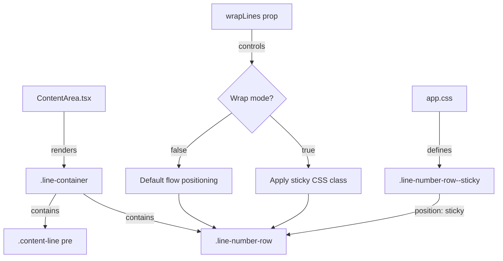

# Design Document: Sticky Line Numbers

## Overview

This feature makes line numbers "sticky" in wrap mode so they remain visible while scrolling through long wrapped lines. When a physical line wraps across multiple visual rows and the user scrolls partway through it, the line number pins to the top of the viewport — constrained within its parent line container — ensuring the user always knows which line they're reading.

The implementation uses CSS `position: sticky` on the `.line-number-row` element, conditionally applied only when wrap mode is enabled. This is a pure CSS solution that requires no scroll-event-driven JavaScript positioning logic, leveraging the browser's native sticky behavior which automatically constrains the element within its containing block.

## Architecture



**Key architectural decision:** Pure CSS `position: sticky` rather than JavaScript scroll-event positioning.

Rationale:
- `position: sticky` is GPU-accelerated and runs on the compositor thread — zero jank
- No scroll listeners needed for positioning → no JS overhead per frame
- Browser handles containment within parent automatically (line number can't escape its `.line-container`)
- Transition between consecutive sticky lines is handled natively (as one container scrolls out, the next takes over)

The only JS change is adding a conditional CSS class to `.line-number-row` elements when `wrapLines` is true.

## Components and Interfaces

### Modified Components

**ContentArea.tsx** — Line rendering section

Current line-number rendering:
```tsx
<div
  className="line-number-row"
  style={{
    flexShrink: 0, width: 60, textAlign: 'right', paddingRight: 12,
    alignSelf: 'flex-start', height: LINE_HEIGHT, lineHeight: `${LINE_HEIGHT}px`,
  }}
>
  {linesStartLine + index + 1}
</div>
```

Modified rendering (add conditional class + background):
```tsx
<div
  className={`line-number-row${wrapLines ? ' line-number-row--sticky' : ''}`}
  style={{
    flexShrink: 0, width: 60, textAlign: 'right', paddingRight: 12,
    alignSelf: 'flex-start', height: LINE_HEIGHT, lineHeight: `${LINE_HEIGHT}px`,
  }}
>
  {linesStartLine + index + 1}
</div>
```

**app.css** — New CSS rule

```css
.line-number-row--sticky {
  position: sticky;
  top: 0;
  background-color: #1e1e1e;
  z-index: 1;
}
```

### Interface Contract

No new interfaces or props. The existing `wrapLines: boolean` prop on `ContentArea` drives the behavior. The sticky class is applied unconditionally to all line numbers in wrap mode — CSS `position: sticky` only activates when the element's container is taller than the viewport row height (i.e., only for wrapped lines that span multiple visual rows). Single-row lines have `height: 20px` containers, so sticky has no visible effect on them.

### Pure Logic: Sticky Determination Function

For testing purposes, the sticky-determination logic can be extracted as a pure function:

```typescript
/**
 * Determine which line index (if any) should appear sticky given current scroll state.
 * Returns -1 if no line should be sticky.
 */
function determineStickyLine(
  wrapMode: boolean,
  lineHeights: number[],  // height of each line container in px
  scrollTop: number,      // current viewport scroll offset
  lineHeight: number      // single-row height (20px)
): number {
  if (!wrapMode) return -1;
  
  let accumulatedTop = 0;
  let stickyIndex = -1;
  
  for (let i = 0; i < lineHeights.length; i++) {
    const containerTop = accumulatedTop;
    const containerBottom = accumulatedTop + lineHeights[i];
    
    // Line is a wrapped line (height > single row) AND partially scrolled above viewport
    if (lineHeights[i] > lineHeight && containerTop < scrollTop && containerBottom > scrollTop) {
      stickyIndex = i;
    }
    
    accumulatedTop += lineHeights[i];
    
    // Once we pass the viewport top, no further lines can be sticky
    if (containerTop >= scrollTop) break;
  }
  
  return stickyIndex;
}
```

This function models what CSS `position: sticky` does natively, and is the testable unit for property-based tests.

## Data Models

No new data models. The feature operates entirely on existing DOM structure and CSS properties.

**Existing relevant state:**
- `wrapLines: boolean` — prop passed to ContentArea
- `LINE_HEIGHT = 20` — constant for single-row height
- `.line-container` — flex row with `minHeight: LINE_HEIGHT`, actual height determined by content wrapping
- `.line-number-row` — gutter element, `width: 60px`, `alignSelf: flex-start`

## Correctness Properties

*A property is a characteristic or behavior that should hold true across all valid executions of a system — essentially, a formal statement about what the system should do. Properties serve as the bridge between human-readable specifications and machine-verifiable correctness guarantees.*

### Property 1: Sticky determination correctness

*For any* scroll position and set of line heights in wrap mode, the `determineStickyLine` function returns a valid line index if and only if that line is a wrapped line (height > LINE_HEIGHT) whose container spans the viewport top edge (containerTop < scrollTop < containerBottom). When no such line exists, it returns -1.

**Validates: Requirements 1.1, 1.2, 1.3, 1.4**

### Property 2: No sticky in non-wrap mode

*For any* scroll position and set of line heights, when wrap mode is disabled, `determineStickyLine` always returns -1 (no line is sticky).

**Validates: Requirements 2.1, 2.3**

### Property 3: At-most-one sticky invariant

*For any* scroll position and set of line heights (including multiple consecutive wrapped lines), `determineStickyLine` returns at most one line index — the topmost wrapped line whose first visual row is above the viewport top edge.

**Validates: Requirements 4.1, 4.2, 4.3**

## Error Handling

This feature has minimal error surface:

| Scenario | Handling |
|----------|----------|
| `wrapLines` toggles while scrolled | CSS class added/removed reactively; browser recalculates layout. No special handling needed. |
| Line container has zero height | Impossible — `minHeight: LINE_HEIGHT` ensures minimum 20px. |
| Very large number of wrapped lines | CSS `position: sticky` is per-element, no performance concern — browser only computes for visible elements in the scroll container. |
| Browser doesn't support `position: sticky` | All modern browsers support it (Chrome 56+, Firefox 59+, Safari 13+). Photino uses Chromium — guaranteed support. Graceful degradation: line numbers scroll normally (pre-feature behavior). |

## Testing Strategy

### Property-Based Tests (fast-check + vitest)

The `determineStickyLine` pure function is the testable core. Three property tests:

1. **Sticky determination correctness** — Generate random `(lineHeights[], scrollTop)` with `wrapMode=true`. Verify the returned index satisfies the sticky condition (wrapped line spanning viewport top), or -1 if none qualifies.
2. **No sticky in non-wrap mode** — Generate random `(lineHeights[], scrollTop)` with `wrapMode=false`. Assert result is always -1.
3. **At-most-one invariant** — Generate random configurations with multiple wrapped lines. Assert the function returns exactly one index or -1 (never multiple).

Configuration: minimum 100 iterations per property, using `fast-check` library.
Tag format: `Feature: sticky-line-numbers, Property {N}: {description}`

### Unit Tests (example-based)

- Verify `.line-number-row--sticky` class is applied when `wrapLines=true`
- Verify `.line-number-row--sticky` class is NOT applied when `wrapLines=false`
- Verify CSS rule includes `position: sticky`, `top: 0`, `background-color: #1e1e1e`, `z-index: 1`
- Verify line-number styling consistency (width 60px, color #858585, font-size 14px, padding-right 12px) in both states

### Integration / Visual Tests

- Manual verification that sticky transition between consecutive wrapped lines is smooth
- Manual verification that sticky line number doesn't escape its container bounds
- Manual verification of no horizontal shift during sticky transitions
