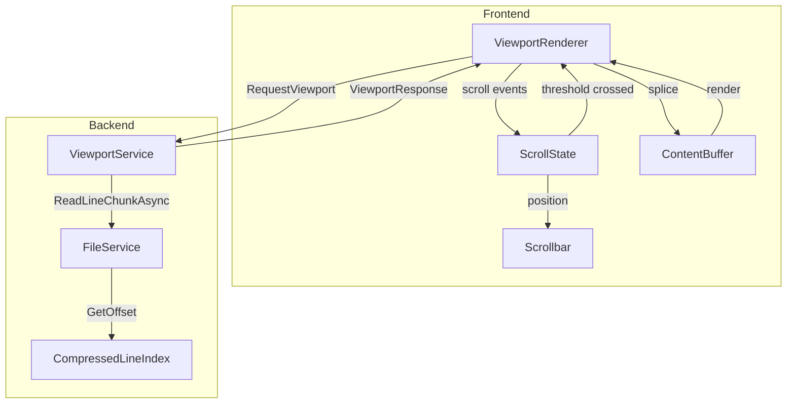
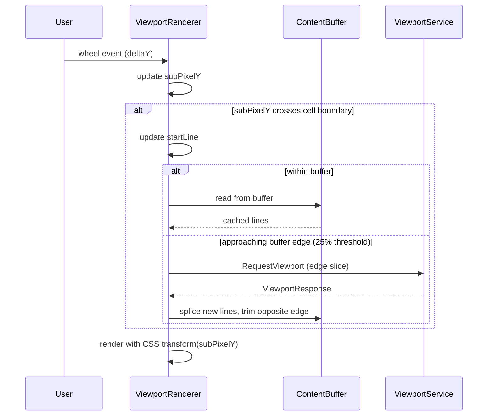
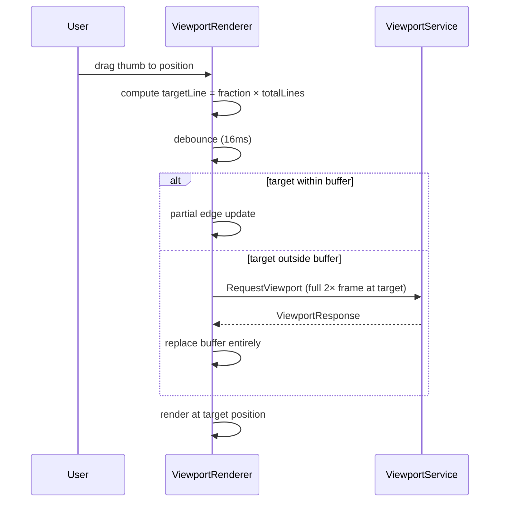
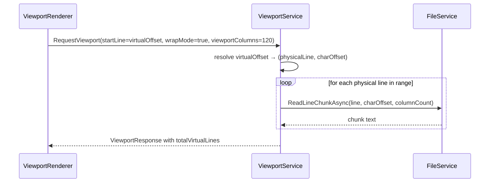

# Design Document: Viewport Text Rendering

## Overview

This design replaces the current sliding-window virtual scroll (ContentArea.tsx with WINDOW_SIZE=400, FETCH_SIZE=200) with a true viewport-based rendering system. The new system delivers only the exact rectangular character slice visible on screen, enabling seamless navigation of files with millions of lines and millions of characters per line.

**Key architectural changes:**
1. **Backend ViewportService** — new service composing viewport responses from existing FileService primitives (ReadLineChunkAsync, CompressedLineIndex, GetLineCharLength)
2. **Frontend ViewportRenderer** — new React component replacing ContentArea's rendering, using fixed-width font metrics for scrollbar computation (no DOM measurement)
3. **Oversized buffer strategy** — 2× viewport on both axes, prefetch at 25% threshold, incremental edge updates
4. **New message protocol** — RequestViewport / ViewportResponse replacing RequestLines / LinesResponse for content display
5. **Wrap mode** — backend computes virtual line mapping from stored line lengths
6. **Unicode safety** — always read from line start via StreamReader, never raw byte seek to mid-line



## Architecture

### System Layers

```
┌─────────────────────────────────────────────────────┐
│  ViewportRenderer (React)                           │
│  - Scroll state management                          │
│  - Buffer management (2× oversized)                 │
│  - Scrollbar computation (char/line counts)         │
│  - Incremental edge updates                         │
│  - Smooth sub-pixel scrolling via CSS transform     │
└──────────────────────┬──────────────────────────────┘
                       │ RequestViewport / ViewportResponse
                       │ (JSON via Photino MessageBridge)
┌──────────────────────┴──────────────────────────────┐
│  ViewportService (C#)                               │
│  - Viewport rect → line/col resolution              │
│  - Wrap mode virtual line mapping                   │
│  - Max line length tracking                         │
│  - Response size enforcement (≤4MB)                 │
│  - Composes from FileService primitives             │
└──────────────────────┬──────────────────────────────┘
                       │ ReadLineChunkAsync, GetLineCharLength
┌──────────────────────┴──────────────────────────────┐
│  FileService (C# — existing, unchanged)             │
│  - CompressedLineIndex for byte offsets             │
│  - Seek-based partial line reads                    │
│  - Unicode-safe StreamReader from line start        │
└─────────────────────────────────────────────────────┘
```

### Design Decisions

| Decision | Rationale |
|----------|-----------|
| New ViewportService rather than extending PhotinoHostService | Separation of concerns — viewport logic is complex enough to warrant its own service |
| 2× buffer on both axes | Covers typical mouse wheel scroll without backend round-trip; 4× total area is manageable memory |
| Prefetch at 25% remaining | Gives ~75% of buffer travel before needing new data; hides latency |
| Scrollbar from char/line counts (no DOM) | DOM measurement is expensive and unreliable for virtual content; monospace assumption makes arithmetic exact |
| Backend computes virtual line count for wrap | Frontend doesn't have all line lengths; backend has CompressedLineIndex with O(1) per-line byte length |
| Max line length computed during scan | Avoids separate pass; byte-length heuristic is sufficient for scrollbar sizing |
| Always read from line start (Unicode safety) | Seeking to arbitrary byte offset in UTF-8 can land mid-codepoint; StreamReader from line start guarantees correctness |
| CSS transform for sub-pixel offset | Avoids layout recalculation; GPU-composited for 60fps |

## Components and Interfaces

### Backend Components

#### ViewportService (new)

```csharp
public interface IViewportService
{
    /// <summary>
    /// Serve a viewport response for the given rectangular region.
    /// In no-wrap mode: startLine/lineCount are physical lines.
    /// In wrap mode: startLine is a virtual line offset, resolved internally.
    /// </summary>
    Task<ViewportResult> GetViewportAsync(
        string filePath,
        int startLine,
        int lineCount,
        int startColumn,
        int columnCount,
        bool wrapMode,
        int viewportColumns,
        CancellationToken cancellationToken = default);

    /// <summary>
    /// Compute total virtual line count for wrap mode given a column width.
    /// Uses stored line lengths — O(N) where N = physical line count.
    /// </summary>
    int GetVirtualLineCount(string filePath, int columnWidth);

    /// <summary>
    /// Get the maximum character length across all lines in the file.
    /// Computed during file scan, stored in metadata.
    /// </summary>
    int GetMaxLineLength(string filePath);
}
```

#### ViewportResult (new model)

```csharp
public record ViewportResult(
    string[] Lines,           // Character slices for each line in range
    int StartLine,            // Physical start line (resolved from virtual if wrap)
    int StartColumn,          // Start column served
    int TotalPhysicalLines,   // Total physical lines in file
    int[] LineLengths,        // Character length of each physical line in range
    int MaxLineLength,        // Max char length across entire file
    int? TotalVirtualLines,   // Only set in wrap mode
    bool Truncated            // True if response was capped at 4MB
);
```

#### FileOpenedResponse extension

```csharp
// Add to existing FileOpenedResponse:
[JsonPropertyName("maxLineLength")]
public int MaxLineLength { get; set; }
```

#### Max line length computation

During `OpenFileAsync` scan, track max byte-length delta between consecutive line offsets. Store as `MaxLineLength` in `CacheEntry`. For UTF-8, byte length ≈ char length (conservative overestimate for non-ASCII). This adds negligible overhead since we already iterate all bytes.

### Frontend Components

#### ViewportRenderer (new React component)

Replaces ContentArea.tsx for content display.

```typescript
interface ViewportState {
  // Logical position
  startLine: number;       // First visible line (physical or virtual)
  startColumn: number;     // First visible column
  // Sub-pixel offsets for smooth scrolling
  subPixelY: number;       // Vertical sub-pixel offset (0 to lineHeight)
  subPixelX: number;       // Horizontal sub-pixel offset (0 to charWidth)
  // Viewport dimensions (auto-detected)
  rows: number;            // Visible rows
  columns: number;         // Visible columns
  // Mode
  wrapMode: boolean;
}

interface ContentBuffer {
  lines: string[];         // Buffered content (2× viewport height)
  bufferStartLine: number; // First line in buffer
  bufferStartCol: number;  // First column in buffer
  bufferRows: number;      // Total rows in buffer
  bufferCols: number;      // Total columns in buffer
}

interface FileMeta {
  totalLines: number;
  maxLineLength: number;
  totalVirtualLines?: number; // Only in wrap mode
}
```

#### Scrollbar Component

Pure computation from state — no DOM measurement:

```typescript
// Vertical
thumbHeight = (rows / totalLines) * trackHeight;
thumbPosition = (startLine / totalLines) * trackHeight;

// Horizontal (no-wrap only)
thumbWidth = (columns / maxLineLength) * trackWidth;
thumbPosition = (startColumn / maxLineLength) * trackWidth;
```

#### Char Cell Measurement

Measured once at startup:
```typescript
function measureCharCell(): { width: number; height: number } {
  const el = document.createElement('span');
  el.style.font = 'monospace'; // match editor font
  el.style.position = 'absolute';
  el.style.visibility = 'hidden';
  el.textContent = 'M';
  document.body.appendChild(el);
  const rect = el.getBoundingClientRect();
  document.body.removeChild(el);
  return { width: rect.width, height: rect.height };
}
```

### Message Protocol

#### RequestViewport (frontend → backend)

```json
{
  "type": "RequestViewport",
  "payload": {
    "startLine": 1000,
    "lineCount": 80,
    "startColumn": 0,
    "columnCount": 200,
    "wrapMode": false,
    "viewportColumns": 120
  }
}
```

#### ViewportResponse (backend → frontend)

```json
{
  "type": "ViewportResponse",
  "payload": {
    "lines": ["line content...", ...],
    "startLine": 1000,
    "startColumn": 0,
    "totalPhysicalLines": 5000000,
    "lineLengths": [45, 120, 0, ...],
    "maxLineLength": 2500000,
    "totalVirtualLines": null,
    "truncated": false
  }
}
```

### Interaction Flows

#### Mouse Wheel Scroll (vertical)



#### Scrollbar Thumb Drag (jump)



#### Wrap Mode Virtual Line Resolution



## Data Models

### Backend Models

```csharp
// New message types
public class RequestViewport : IMessage
{
    [JsonPropertyName("startLine")]
    public int StartLine { get; set; }

    [JsonPropertyName("lineCount")]
    public int LineCount { get; set; }

    [JsonPropertyName("startColumn")]
    public int StartColumn { get; set; }

    [JsonPropertyName("columnCount")]
    public int ColumnCount { get; set; }

    [JsonPropertyName("wrapMode")]
    public bool WrapMode { get; set; }

    [JsonPropertyName("viewportColumns")]
    public int ViewportColumns { get; set; }
}

public class ViewportResponse : IMessage
{
    [JsonPropertyName("lines")]
    public string[] Lines { get; set; } = Array.Empty<string>();

    [JsonPropertyName("startLine")]
    public int StartLine { get; set; }

    [JsonPropertyName("startColumn")]
    public int StartColumn { get; set; }

    [JsonPropertyName("totalPhysicalLines")]
    public int TotalPhysicalLines { get; set; }

    [JsonPropertyName("lineLengths")]
    public int[] LineLengths { get; set; } = Array.Empty<int>();

    [JsonPropertyName("maxLineLength")]
    public int MaxLineLength { get; set; }

    [JsonPropertyName("totalVirtualLines")]
    public int? TotalVirtualLines { get; set; }

    [JsonPropertyName("truncated")]
    public bool Truncated { get; set; }
}

// Extended CacheEntry (internal)
internal record CacheEntry(
    CompressedLineIndex Index,
    Encoding Encoding,
    long FileSize,
    DateTime LastWriteTimeUtc,
    int MaxLineLength  // NEW: max char length across all lines
);
```

### Frontend Models

```typescript
// Viewport request/response types
interface RequestViewportPayload {
  startLine: number;
  lineCount: number;
  startColumn: number;
  columnCount: number;
  wrapMode: boolean;
  viewportColumns: number;
}

interface ViewportResponsePayload {
  lines: string[];
  startLine: number;
  startColumn: number;
  totalPhysicalLines: number;
  lineLengths: number[];
  maxLineLength: number;
  totalVirtualLines: number | null;
  truncated: boolean;
}

// Buffer management
interface BufferState {
  lines: string[];
  startLine: number;
  startCol: number;
  lineCount: number;
  colCount: number;
}

// Scroll state
interface ScrollState {
  line: number;
  column: number;
  subPixelY: number;
  subPixelX: number;
}
```

### Virtual Line Mapping (Wrap Mode)

The ViewportService resolves virtual line offsets to physical positions:

```
Given: virtualLineOffset, columnWidth
Algorithm:
  physicalLine = 0
  virtualLinesConsumed = 0
  for each physical line i:
    lineLen = GetLineCharLength(filePath, i)
    virtualLinesForLine = ceil(max(1, lineLen) / columnWidth)
    if virtualLinesConsumed + virtualLinesForLine > virtualLineOffset:
      // Target is within this physical line
      segmentIndex = virtualLineOffset - virtualLinesConsumed
      charOffset = segmentIndex * columnWidth
      return (physicalLine=i, charOffset)
    virtualLinesConsumed += virtualLinesForLine
```

For performance with millions of lines, this linear scan is cached/indexed. The total virtual line count is computed once per column width change and cached.

### Response Size Enforcement

```
MaxPayloadBytes = 4_000_000
EstimatedBytesPerChar ≈ 2 (JSON string encoding overhead)
MaxCharsPerResponse = MaxPayloadBytes / EstimatedBytesPerChar = 2_000_000
If (lineCount × columnCount) > MaxCharsPerResponse:
  Reduce lineCount to fit, set truncated=true
```

## Correctness Properties

*A property is a characteristic or behavior that should hold true across all valid executions of a system — essentially, a formal statement about what the system should do. Properties serve as the bridge between human-readable specifications and machine-verifiable correctness guarantees.*

### Property 1: Viewport slicing returns correct rectangular region

*For any* file with N physical lines, and *for any* valid viewport request (startLine, lineCount, startColumn, columnCount), the ViewportService SHALL return an array where each element equals the substring `physicalLine[startCol .. startCol+colCount]` of the corresponding physical line, or empty string if the line is shorter than startColumn. The response SHALL include the correct totalPhysicalLines and per-line character lengths.

**Validates: Requirements 1.1, 1.4, 1.5**

### Property 2: Scrollbar position and size computation

*For any* positive integers (visibleUnits, totalUnits, currentOffset) where visibleUnits ≤ totalUnits and currentOffset ≤ totalUnits - visibleUnits, the scrollbar thumb size SHALL equal (visibleUnits / totalUnits) × trackSize, and thumb position SHALL equal (currentOffset / totalUnits) × trackSize. This applies to vertical (rows/totalLines), horizontal (columns/maxLineLength), and wrap mode (rows/totalVirtualLines). Conversely, for any thumb fraction f ∈ [0,1], the target offset SHALL equal floor(f × totalUnits).

**Validates: Requirements 2.1, 2.2, 2.3, 7.1, 7.2**

### Property 3: Virtual line count formula

*For any* array of physical line character lengths and *for any* positive column width W, the total virtual line count SHALL equal the sum of `ceil(max(1, lineLength) / W)` across all physical lines. Empty lines (length 0) SHALL count as exactly one virtual line.

**Validates: Requirements 3.2, 11.1, 11.5**

### Property 4: Virtual-to-physical line mapping

*For any* array of physical line lengths, column width W, and virtual line offset V (where 0 ≤ V < totalVirtualLines), resolving V to (physicalLine, charOffset) SHALL satisfy: the sum of virtual lines for physical lines [0, physicalLine) equals V minus the segment index within that physical line, and charOffset equals segmentIndex × W. Reading columnCount characters from that position SHALL return the correct segment of the physical line.

**Validates: Requirements 3.1, 3.3, 9.3**

### Property 5: Buffer update strategy selection

*For any* buffer state (bufferStartLine, bufferLineCount) and *for any* target scroll position targetLine, IF targetLine is within [bufferStartLine, bufferStartLine + bufferLineCount), THEN a partial edge update SHALL be performed (no full buffer replacement). IF targetLine is outside the buffer boundaries, THEN the entire buffer SHALL be replaced with a new 2× frame centered on targetLine.

**Validates: Requirements 6.5, 6.6, 7.3**

### Property 6: Incremental edge update correctness

*For any* buffer state and *for any* small scroll delta (≤ buffer size - viewport size), the edge update SHALL request only the lines/columns entering the buffer at the scroll direction edge (count = delta), and trim the same count from the opposite edge. The resulting buffer size SHALL remain constant (2× viewport). Existing content in the overlap region SHALL be unchanged.

**Validates: Requirements 6.2, 6.3, 6.4**

### Property 7: Prefetch threshold trigger

*For any* buffer state and scroll position, IF the remaining buffer in the scroll direction is less than 25% of total buffer size, THEN a prefetch request SHALL be triggered. IF the remaining buffer is ≥ 25%, THEN no backend request SHALL be made (rendering is purely frontend).

**Validates: Requirements 6.8, 6.9, 6.10**

### Property 8: Response size enforcement with truncation

*For any* viewport request, the serialized ViewportResponse JSON payload SHALL NOT exceed 4,000,000 bytes. IF the requested (lineCount × columnCount) would produce a response exceeding this limit, THEN the ViewportService SHALL reduce lineCount, set `truncated = true`, and the actual response size SHALL be ≤ 4MB.

**Validates: Requirements 8.3, 9.4, 9.5**

### Property 9: Maximum line length correctness

*For any* file, after opening (or refreshing), the stored maxLineLength SHALL be greater than or equal to the actual maximum character length across all physical lines. For single-byte and UTF-8 encodings, the estimate SHALL be derived from byte-length differences between consecutive line offsets and SHALL always be ≥ the true character length (conservative overestimate).

**Validates: Requirements 4.5, 10.1, 10.5**

### Property 10: Unicode viewport read correctness

*For any* file containing arbitrary Unicode content (including multibyte UTF-8 sequences and surrogate pairs), and *for any* valid (lineNumber, startColumn, columnCount) request, the ViewportService SHALL return a string that equals the substring of the logical character sequence of that line from index startColumn to startColumn + columnCount. No partial byte sequences or split surrogate pairs SHALL appear in the output. The result SHALL be identical regardless of internal access method (sequential scan vs seek-based).

**Validates: Requirements 14.1, 14.3, 14.4, 14.5**

### Property 11: Viewport dimensions from pixel measurements

*For any* container dimensions (pixelWidth, pixelHeight) and char cell size (cellWidth, cellHeight) where all values are positive, the computed viewport dimensions SHALL be rows = floor(pixelHeight / cellHeight) and columns = floor(pixelWidth / cellWidth).

**Validates: Requirements 12.1**

### Property 12: Oversized buffer request sizing

*For any* viewport dimensions (rows, columns), the initial buffer request to the ViewportService SHALL specify at least 2× rows for lineCount and at least 2× columns for columnCount, ensuring small scrolls are served from local buffer without backend round-trip.

**Validates: Requirements 6.1**

## Error Handling

### Backend Errors

| Error Condition | Handling |
|----------------|----------|
| File not found during viewport read | Send ErrorResponse with FILE_NOT_FOUND code; frontend shows error state |
| Line number out of range | Clamp to valid range (0 to totalLines-1); return partial result |
| Start column beyond line length | Return empty string for that line (not an error) |
| Response would exceed 4MB | Reduce lineCount, set truncated=true, return partial viewport |
| File modified during read (stale) | Fire OnStaleFileDetected event; serve from existing cache; refresh cycle handles re-scan |
| Cancellation (new file opened) | Abort viewport computation; no response sent |
| Invalid viewport request (negative values) | Clamp to 0; return valid partial result |

### Frontend Errors

| Error Condition | Handling |
|----------------|----------|
| Viewport response truncated | Display available content; log warning; frontend may re-request smaller viewport |
| Backend timeout (no response) | Show loading indicator after 500ms; retry once; show error after second timeout |
| Window resize during pending request | Cancel pending request; issue new request with updated dimensions |
| Zero char cell measurement | Fall back to default (8px × 16px); log warning |

### Graceful Degradation

- If ViewportService is unavailable (e.g., during file scan), frontend shows loading state
- If maxLineLength is 0 (empty file), horizontal scrollbar is hidden
- If virtual line count computation is slow (millions of lines), response includes `totalVirtualLines: null` and frontend uses physical line count as fallback until computation completes

## Testing Strategy

### Property-Based Tests (Backend — C# with FsCheck)

Property-based testing is appropriate for this feature because:
- ViewportService has clear input/output behavior (viewport rect → content slice)
- Virtual line mapping is pure computation with large input space
- Response size enforcement must hold for all possible inputs
- Unicode correctness must hold across all character combinations

**Configuration:** Minimum 100 iterations per property test.

**Tag format:** `Feature: viewport-text-rendering, Property {N}: {title}`

Tests to implement:
1. **Viewport slicing** — generate random file content + viewport rects, verify correct substrings returned
2. **Scrollbar computation** — generate random (visible, total, offset) triples, verify formula
3. **Virtual line count** — generate random line length arrays + column widths, verify sum formula
4. **Virtual-to-physical mapping** — generate line lengths + virtual offsets, verify resolution
5. **Buffer update strategy** — generate buffer bounds + targets, verify partial/full decision
6. **Edge update correctness** — generate buffer state + deltas, verify trim/append behavior
7. **Prefetch threshold** — generate buffer state + positions, verify trigger decision
8. **Response size enforcement** — generate large viewport requests, verify ≤ 4MB
9. **Max line length** — generate random file content, verify estimate ≥ actual max
10. **Unicode correctness** — generate Unicode strings with multibyte/surrogates, verify correct slicing
11. **Viewport dimensions** — generate pixel/cell sizes, verify floor division
12. **Buffer sizing** — generate viewport dimensions, verify 2× request

### Unit Tests (Backend — xUnit)

- ViewportService returns empty array for empty file
- ViewportService handles single-line file
- ViewportService handles startColumn = 0 (full line start)
- Response truncation sets flag correctly
- MaxLineLength updated on file refresh
- FileOpenedResponse includes maxLineLength field
- Virtual line count for file with all empty lines = physical line count
- Wrap mode with column width = 1 produces virtual lines = sum of all char lengths

### Frontend Tests (vitest + fast-check)

**Property tests:**
- Scrollbar computation (fast-check): random inputs → verify formula
- Buffer update decision (fast-check): random buffer/target → verify strategy
- Prefetch threshold (fast-check): random positions → verify trigger
- Viewport dimensions (fast-check): random pixel/cell → verify floor division
- Edge update (fast-check): random buffer + delta → verify trim/append sizes

**Unit tests:**
- ViewportRenderer renders correct number of rows
- Horizontal scrollbar hidden in wrap mode
- Char cell measured once (not per render)
- Debounce prevents multiple rapid requests
- CSS transform applied with sub-pixel offset
- No RequestLines messages sent when viewport active

### Integration Tests

- Full round-trip: open file → request viewport → verify content matches file
- Wrap mode: open file → request virtual line → verify correct physical segment
- Large file (1M+ lines): verify viewport response time < 100ms
- File refresh: modify file → verify maxLineLength updates in next response

